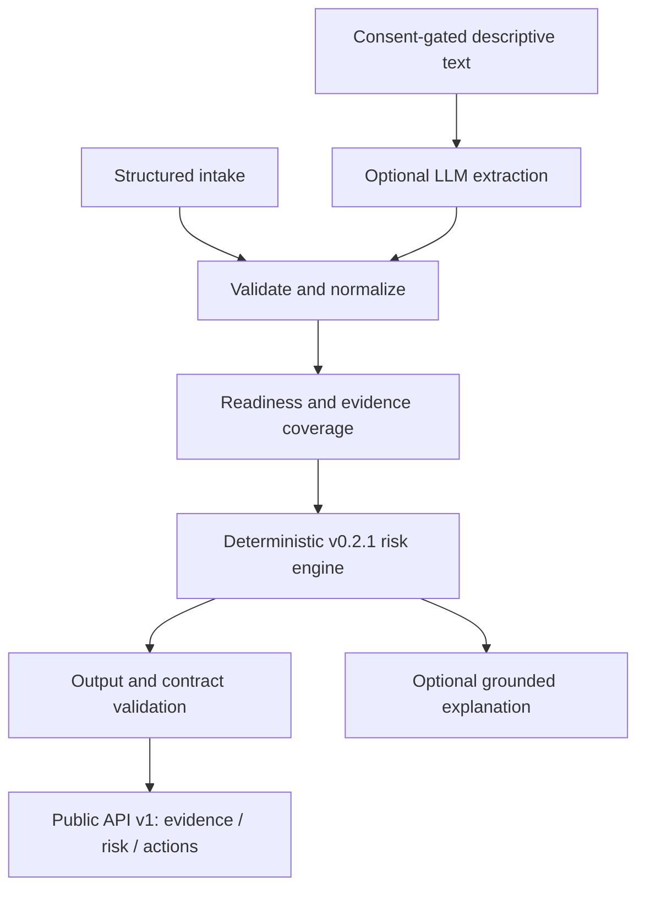

# FlowCredit — Risk Intelligence Infrastructure for the AI-Native Economy

> **Development workspace.** This repository is used for update testing and development only. It does not deploy and is not connected to the production service or the published demo; see [development isolation](docs/dev-isolation.md).

An evidence-aware risk API for AI-native businesses and agents: normalize operational evidence, compute deterministic risk signals, and return review status and prioritized actions.

**Evidence → Risk → Action**

**Stack:** JavaScript · Node.js · JSON Schema / Ajv · Docker

**Status:** External Alpha `v0.1.1`; experimental risk intelligence, not calibrated lending decisions.

[Quick Start](#quick-start) · [API](docs/public-api-v1.md) · [Methodology](docs/flowcredit-rules-v0.2.1.md) · [Validation](docs/portfolio-validation.md) · [MIT](LICENSE)

## Key Results

| Verified capability | Scope / evidence |
| --- | --- |
| **100/100 tests passed** | Local regression run on 2026-09-13; [current progress and validation](docs/进展说明-20260913.md) |
| **5 TAI components; 5 CCI dimensions** | Versioned deterministic weights, [rule registry](agent/src/rules-v021.js) |
| **6 evidence source domains; 3 confirmed-event veto codes** | Input/provenance model, not six connected external providers; [rules](agent/src/rules-v021.js) |
| Public API + Finch contract validators passed | Synthetic fixtures; no Finch approval or publication implied |

These are engineering checks and structural properties, not model accuracy, production users or commercial traction.

## What is FlowCredit

FlowCredit assesses evidence readiness, field coverage, activity consistency, counterparty-risk signals and required follow-up. Intended consumers include AI service operators, compute providers and agent marketplaces. They retain final policy and transaction decisions.

## Why AI-native businesses need a different risk model

Token activity alone does not establish revenue quality or repayment capacity. FlowCredit connects compute, commercial and provenance evidence, exposes missing or inconsistent fields, and avoids substituting an opaque model-generated score for accountable rules.

## Evidence → Risk → Action

| Stage | Implemented output |
| --- | --- |
| Evidence | Normalized fields, provenance, recency, coverage and missing evidence |
| Risk | TAI, CCI, evidence-quality score, grade, risk signals and confirmed-integrity veto |
| Action | Review status and prioritized evidence requests; no automatic loan approval |

Multi-source evidence **acceptance and normalization** are implemented. Live billing, bank, identity and chain connectors are future work; input verification metadata is not itself a proof that an external source is authentic.

## Architecture



Implementation: [intake](agent/src/intake-v03.js), [normalization](agent/src/normalize-v021.js), [risk engine](agent/src/risk-core-v021.js), [validation](agent/src/validate-v021.js), [API server](agent/src/server.js).

## Risk Pipeline

1. Validate the intake contract and normalize numeric/evidence fields.
2. Reconcile Token totals and classification buckets; identify missing or inconsistent periods.
3. Compute evidence quality and TAI/CCI only when required components are computable.
4. Apply integrity rules: unverified indicators are signals; eligible confirmed events can trigger veto.
5. Validate authoritative output and serialize the versioned API envelope.

The static browser retains a **mock-hash Merkle tree/proof demonstration** and simulated shock → de-risk → recover sequence in [state.js](assets/js/state.js). These are historical UI demonstrations, not cryptographic integrity verification, blockchain transactions or an exposed production stress-testing API. API fingerprints are reproducibility identifiers, not evidence authenticity guarantees.

## TAI / CCI

[Version v0.2.1 methodology](docs/flowcredit-rules-v0.2.1.md):

```text
TAI (0–100) = reconciliation×10% + validity×35% + physical×25%
            + commercial×20% + continuity×10%

CCI (0–1000) = round((TAI×40% + repayment×25% + customer×15%
              + economics×10% + operatingContinuity×10%) × 10)
```

Missing required components produce `null`, rather than redistributing weights. Current normalization/peer profiles are simulated references; their sample-size fields are fixture metadata, not a verified real-world cohort. TAI is not revenue and CCI is not a calibrated default probability. `PD_pct`, `expectedLoss` and `recommendedLimit` remain `null` in v0.2.1.

## Deterministic Engine vs LLM Sidecar

**LLM may assist with evidence extraction or explanation, but deterministic rules own authoritative risk outputs.** Structured assessments remain available without DeepSeek. Descriptive text extraction requires explicit model consent; model output cannot overwrite authoritative scores. This project integrates a model provider; it does not train a foundation model.

## API

```http
POST /api/v1/assess
Authorization: Bearer <API_KEY>
Content-Type: application/json
```

```text
API:         flowcredit.api/v1
Intake:      flowcredit.intake/v0.3.1
Risk engine: flowcredit.risk_result/v0.2.1
```

Read canonical business fields under `data.*`. Bearer authentication, bounded payloads, rate limits, timeout and single-instance idempotency are implemented. See [schemas and fixtures](agent/contracts/README.md) and [API semantics](docs/public-api-v1.md).

## Quick Start

```bash
git clone https://github.com/Anhao1314/flowcredit-v2.git
cd flowcredit-v2/agent
export FC_RUNTIME_ROOT="/Users/yimingyang/fc-agent/runtime"
mkdir -p "$FC_RUNTIME_ROOT"
cp .env.example "$FC_RUNTIME_ROOT/.env"
chmod 600 "$FC_RUNTIME_ROOT/.env"
```

Set a unique `FLOWCREDIT_API_KEY` of at least 16 characters in the external runtime configuration described in [agent setup](agent/README.md), then:

```bash
docker compose --env-file "$FC_RUNTIME_ROOT/.env" up --build -d
curl --fail http://127.0.0.1:8787/ready
```

For a local authenticated assessment, replace the key placeholder:

```bash
curl --fail-with-body -X POST http://127.0.0.1:8787/api/v1/assess   -H 'Authorization: Bearer <YOUR_LOCAL_API_KEY>'   -H 'Content-Type: application/json'   -H 'Idempotency-Key: example-assessment-001'   --data-binary @contracts/finch-test-input.json
```

Open `http://127.0.0.1:8787/` for the interface. Public-style configuration protects browser mutating calls too; never embed the API secret in static JavaScript. DeepSeek is optional. Open root `index.html` directly for browser-local structured assessment: explore the worked example, edit nine basic fields, add evidence, then print or export a restorable JSON snapshot. Offline and online use one deterministic result layout; optional AI extraction and explanation have separate consent.

## Docker

[Dockerfile](agent/Dockerfile) pins the base image digest and installs production dependencies from the lockfile. Compose publishes to loopback by default. External deployment requires managed secrets, enabled authentication and HTTPS; see [deployment guide](docs/external-alpha-deployment.md) and [checklist](docs/public-deployment-checklist.md). No new deployment is performed by the Portfolio documentation update.

## Example Risk Cases

| Synthetic case | Expected behavior |
| --- | --- |
| Complete simulated operator | Computable activity/risk signals with `simulation-only` status |
| Missing components or unreconciled Token buckets | Missing-data findings and non-computable scores where required |
| Unverified Sybil indicator | Risk signal, not a confirmed veto by itself |
| Eligible confirmed integrity event | Veto reflected in grade/review result |

See [test cases](agent/test/risk-core-v021.test.js) and [representative input/output](agent/contracts/README.md). Legacy browser PD/limit values are simulation calibration and are not the current API's lending outputs.

## Finch Integration

A Direct API contract, validators and technical handoff package exist. **Not submitted, approved, certified or published by Finch.** Finch is a target integration channel. Read [submission package](docs/finch/SUBMISSION.md), [contract](docs/finch/CONTRACT.md) and [handoff guide](docs/finch/FINCH_HANDOFF_GUIDE.md).

## Reproduction / Tests & Quality

Use the Node versions declared in [package.json](agent/package.json). From `agent/`:

```bash
npm ci
npm run check
npm run validate:public-api
npm run validate:finch-contract
npm run verify:release
```

`check` runs syntax checks, TypeScript `checkJs` for the constants and v0.2/v0.2.1 **rule registries**, and the unit/regression suite. It does not type-check the entire API/sidecar. Deterministic checks use synthetic fixtures without a configured LLM. [CI configuration](.github/workflows/ci.yml) runs installation, tests and these checks; its presence alone does not assert a passing Actions run.

## Current Status / Limitations

- Git tags `external-alpha-v0.1` and `external-alpha-v0.1.1` are existing release references; GitHub Releases is currently empty.
- [Public HTTPS health endpoint](https://flowcredit-api.onrender.com/health) returned `external-alpha-v0.1.1` on 2026-09-12, with LLM disabled. This is a point-in-time availability check, not an uptime or production-readiness claim.
- Final lending/payment decisions, live evidence connectors, production calibration, distributed persistence and compliance certification are outside current capabilities.
- Input provenance and integrity-event confirmation depend on trustworthy upstream verification; the API does not independently verify all supplied evidence.

[Contributing](CONTRIBUTING.md) · [Security reporting](SECURITY.md) · [Changelog](CHANGELOG.md)

## Roadmap

Priorities: trusted evidence connectors and profiles, independent calibration, persistent multi-instance storage, and a reviewed Finch submission. See [roadmap](docs/roadmap.md); these remain future work.

## Hackathon Origin

Originated from the Shenzhen–Hong Kong Hackathon and continued as a post-hackathon productization project. The private historical `DEMO.FlowCredit` repository preserves the original simulated interface; **this repository is the current project**. Hackathon provenance is maintainer-provided context, not an award claim.
