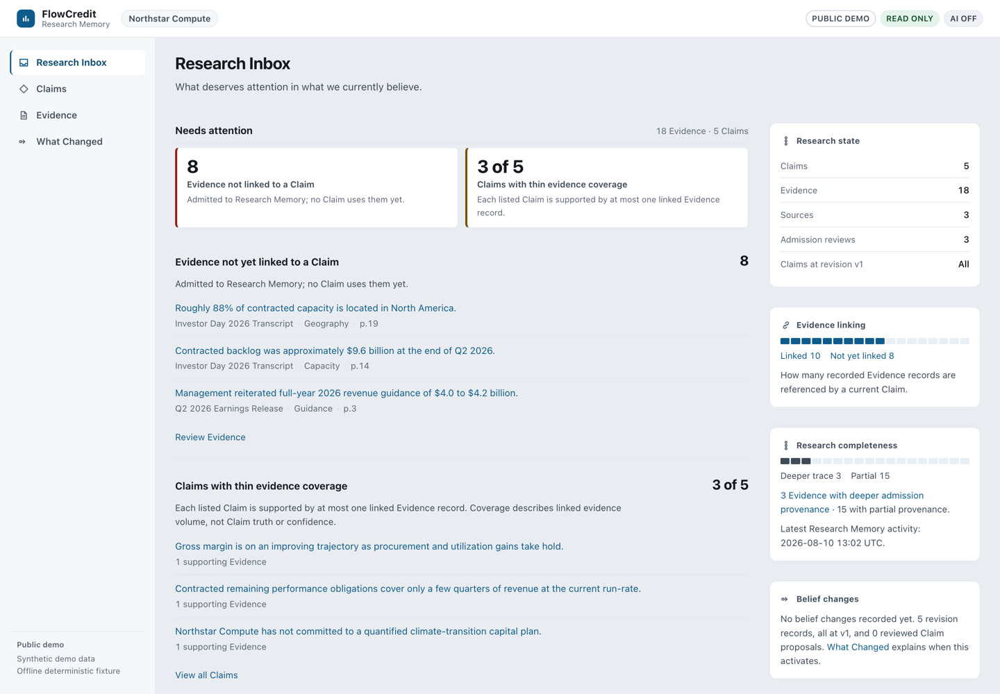
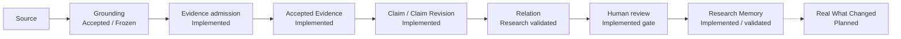
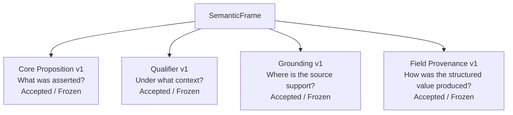

# FlowCredit

> The auditable belief-memory layer for investment research.

`Research Engineering Alpha` · `Architecture-validated prototype` · `Local-first` · `Human-reviewed`

FlowCredit remembers what your team believes, why it believes it, and what new evidence should change.

**What changed in what we believe, and why?**

This repository is the research-engineering workspace for FlowCredit: the pipelines, frozen contracts and local surfaces that make belief change reviewable. It is a development and testing workspace — it does not deploy and is not connected to a production service ([development isolation](docs/dev-isolation.md)). Where each layer stands is recorded in [public status](docs/public/status.md).

FlowCredit is not an AI stock picker, a trading bot, a financial chatbot, generic RAG over filings, an automatic investment-decision engine, or an analyst replacement. It is memory infrastructure with explicit human authority.



*Research Inbox — public synthetic demo.*

## Why FlowCredit

Investment research teams store documents. They rarely preserve belief state.

Filings, earnings calls, models, notes, chat threads and analyst memory each hold part of the work, and the reasoning that connected them rarely survives the next quarter.

Documents are stored. Beliefs are not.

When a number moves, the operational question is not another document. It is reconstructing why the team believed something at a given point in time — and deciding whether the belief should now change.

## The product moment — What Changed

> **Illustrative workflow.** The real end-to-end What Changed loop is not yet productionized. This walkthrough shows the intended semantics.

| Step | Content |
| --- | --- |
| Claim v1 | "Customer concentration remains a material risk." |
| Existing Evidence | Largest customer = 62% of revenue. |
| New Accepted Evidence | Largest customer = 48% of revenue. |
| FlowCredit relation | `COUNTERS` |

`COUNTERS` is a relation label, and only that:

- `COUNTERS` is not "the earlier evidence was false".
- `COUNTERS` is not "the risk disappeared".
- `COUNTERS` is not an automatic Claim revision.

A human reviews the relation and decides whether Claim v2 is warranted, and records why. A relation label never rewrites a belief.

## Evidence ≠ Claim

| Concept | Meaning |
| --- | --- |
| **Evidence** | What was observed. |
| **Claim** | What the research team believes. |

- Evidence: "Largest customer represented 62% of revenue."
- Claim: "Customer concentration remains a material risk."

Evidence is source-grounded and passes an explicit admission boundary. Claims are analyst propositions and versioned beliefs; they carry supporting and counter evidence by reference and change only through human revision.

## How it works



Every accepted research artifact is expected to carry its lineage: which source supports it, which claim revision it applies to, and which human review admitted it. The dashed step is the part that is not built yet and is labelled as such everywhere it appears.

## Structured semantic architecture



The four frozen layers are the current semantic spine:

- **Core Proposition** — what was asserted, as a structured proposition rather than prose.
- **Qualifier** — under what context that proposition holds (period, scope, provenance of derived values).
- **Grounding** — exactly where in the source the support lives, replayable later.
- **Field Provenance** — how a structured value was produced (Grounding = WHERE, Field Provenance = HOW). Contract v1 is accepted/frozen; runtime integration is not yet implemented.

## Current status

| Layer | Status |
| --- | --- |
| Research Memory | Implemented / validated |
| Versioned Claims | Implemented |
| Evidence admission | Implemented |
| Text / Table grounding pipeline | Implemented / validated |
| Hybrid retrieval | Implemented / validated |
| Research workspace UI | Implemented (local, read-only) |
| Core Proposition Contract v1 | Accepted / Frozen |
| Qualifier Contract v1 | Accepted / Frozen |
| Grounding Contract v1 | Accepted / Frozen |
| Hybrid Relation architecture | Research validated |
| Field Provenance Contract v1 | Accepted / Frozen (runtime integration pending) |
| RelationInput Contract v1 | Accepted / Frozen (runtime integration pending) |
| CompatibilityAssessment | Next / not started |
| Production Relation Engine | Not complete |
| Evidence Delta / Impact | Planned |
| Real What Changed | Planned |
| Deterministic risk-assessment prototype (External Alpha v0.1.x) | Legacy — retained, not the current direction |

[public status](docs/public/status.md) is the single source of truth for these labels across the public surface.

## Auditable by construction

Every accepted research artifact should have a lineage:

| Question | Layer |
| --- | --- |
| What was asserted? | Core Proposition Contract v1 |
| Under what context? | Qualifier Contract v1 |
| Where is the source support? | Grounding Contract v1 |
| What does the team currently believe? | Research Memory (versioned Claims + admitted Evidence) |

Historical state is retained: claims are versioned rather than overwritten, evidence keeps its admission review, and superseded records stay readable instead of being silently replaced.

## Grounding v1 highlights

The public README does not need the 853-line contract; these are the properties a technical reader should take away:

- Immutable support snapshots: the exact text or table cell is stored, not re-rendered later.
- Exact text and structured table support, including load-bearing row and column context.
- Version-pinned replay: a historical support is replayed under the versions it was created with.
- No model-invented canonical grounding ids: identifiers resolve to stored artifacts or fail loudly.
- Availability is integrity-bearing, so future-data eligibility boundaries are explicit rather than implicit.
- Legacy page-level grounding stays explicitly legacy and never masquerades as v1 support.

Read the full [Grounding Contract v1](docs/contracts/grounding-v1.md).

## AI and human authority

**AI proposes. Humans retain research authority.**

AI may:

- retrieve candidate evidence,
- interpret difficult semantics,
- propose relations between evidence and a claim,
- summarize what changed.

AI may not:

- silently admit evidence,
- silently mutate Claims,
- rewrite history,
- turn a guess into deterministic truth.

## Abstention is a feature

```
Claim:    "Revenue growth is accelerating."
Evidence: "Revenue grew 40%."
Missing:  the previous growth rate.
Result:   ABSTAINED / AMBIGUOUS
```

40% growth alone does not prove acceleration. The relation layer returns an explicit abstention instead of a directional guess, and the abstention is visible rather than hidden behind a label.

## Development evidence

### Internal development results

| Experiment | Result | Scope |
| --- | ---: | --- |
| Grounded span corpus | 7,687 | Internal research corpus |
| Hybrid retrieval Recall@20 | 1.0 | Current internal retrieval set |
| Hybrid relation prototype | 38 / 41 | Development pair set |
| Deterministic decided subset | 100% | Decided subset only |

> Development evidence only. These are not production SLAs, external benchmarks, or customer outcomes.

- `7,687` is the indexed span count of the internal research corpus ([`research/eval/local-retrieval/retrieval-benchmark.json`](research/eval/local-retrieval/retrieval-benchmark.json)).
- `Recall@20 = 1.0` is measured on the current 16-case internal locked set; smaller cutoffs are materially lower, and the set is small.
- `38 / 41` (0.927 accuracy) is a synthetic development spike with labels written by the same process that wrote the rules ([`research/claim-reasoning-spike/RESULTS.md`](research/claim-reasoning-spike/RESULTS.md)); the deterministic layer decides 30 of 41 pairs and is correct on what it decides.
- These numbers are engineering evidence about the pipeline, not estimates of real-world research quality.

## Frozen contracts

| Contract | Scope |
| --- | --- |
| [Core Proposition Contract v1](docs/contracts/core-proposition-v1.md) | What a structured assertion is, and what must not be collapsed into prose. |
| [Qualifier Contract v1](docs/contracts/qualifier-v1.md) | Context, temporal selectors and provenance expectations for derived values. |
| [Grounding Contract v1](docs/contracts/grounding-v1.md) | Source-support identity, snapshots, replay, cardinality and failure boundaries. |

Relation semantics are frozen separately in [ADR-0.12.1](docs/adr/ADR-0.12.1-relation-semantics.md). Each contract states its own status, parents and revision history.

## Engineering design history

Detailed engineering design logs are retained separately from the normative contracts. They record how each contract was produced; they are not normative.

Normative truth lives in [docs/contracts](docs/contracts) and [docs/adr](docs/adr).

## Repository layout

```text
agent/      deterministic assessment engine, contracts and local model sidecar (legacy prototype line, still tested)
research/   research programs: bridge, memory core, retrieval, admission, grounding, analyst, claim revision, local surface
docs/       contracts (frozen), adr/, design history, audits, public status
assets/     static demo assets for the legacy browser interface
index.html  legacy static demo (historical, simulation only)
deploy/     example reverse-proxy configuration (no deployment exists in this repository)
```

## Local quickstart

**Prerequisites**

```bash
node --version            # ^22.19.0 or >=24.0.0 (see agent/package.json)
python3 --version         # Python 3.12 + PyMuPDF 1.26.5 only for parsing raw PDFs
```

The offline test suites need Node and the locked `agent` dependencies only. Raw PDF parsing additionally needs the pinned PyMuPDF from `research/retrieval/requirements.txt`, which CI installs before the retrieval tests.

**Install**

```bash
cd agent
npm ci                    # locked dependencies; research suites reuse them
```

**Run the deterministic checks**

```bash
# from agent/
npm run check             # syntax, frontend discipline, isolation guard, type-check, unit + regression tests
cd ..

# from the repository root
node --test research/test/*.test.js            # research evidence bridge
node --test research/memory-test/*.test.js     # research memory core
node --test research/grounding-test/*.test.js  # source grounding
node --test research/claim-revision-test/*.test.js
```

CI (`.github/workflows/ci.yml`) runs the agent regression suite plus the research offline suites for the bridge, memory core, retrieval, admission, analyst, grounding, evidence support, local model and local hybrid retrieval. The ranking, target-conversion, claim-revision and claim-relation suites are imported through the agent suite.

**Local research surface**

```bash
node research/surface/server.js      # http://127.0.0.1:4317
```

Read-only, loopback-only, AI off. It renders a Research Memory SQLite that lives outside this repository; with no local memory present it renders an explicit "Research Memory unavailable" state instead of fake data.

> The current public repository is a research-engineering prototype. Real research runtime data stays local-only; a reproducible offline public demo (synthetic Northstar Compute, read-only, AI off) is published under `research/surface/fixtures/public-demo/`.

## Roadmap

Field Provenance Contract v1 and RelationInput Contract v1 are accepted/frozen. Next is CompatibilityAssessment, then the production relation engine, Evidence Delta / Impact, and finally the real What Changed loop. Nothing on this list is claimed as implemented; [public status](docs/public/status.md) is updated when a layer actually lands.

## Status vocabulary

`IMPLEMENTED / VALIDATED` · `ACCEPTED / FROZEN` · `RESEARCH VALIDATED` · `CURRENT` · `PLANNED` · `LEGACY` · `ILLUSTRATIVE`

## License and contributing

- License: [MIT](LICENSE).
- Contributing: [CONTRIBUTING.md](CONTRIBUTING.md); security reporting: [SECURITY.md](SECURITY.md); changes are expected to keep versioned contracts and deterministic authority distinct from optional model assistance.
- This repository is a development workspace; it performs no releases or deployments.
