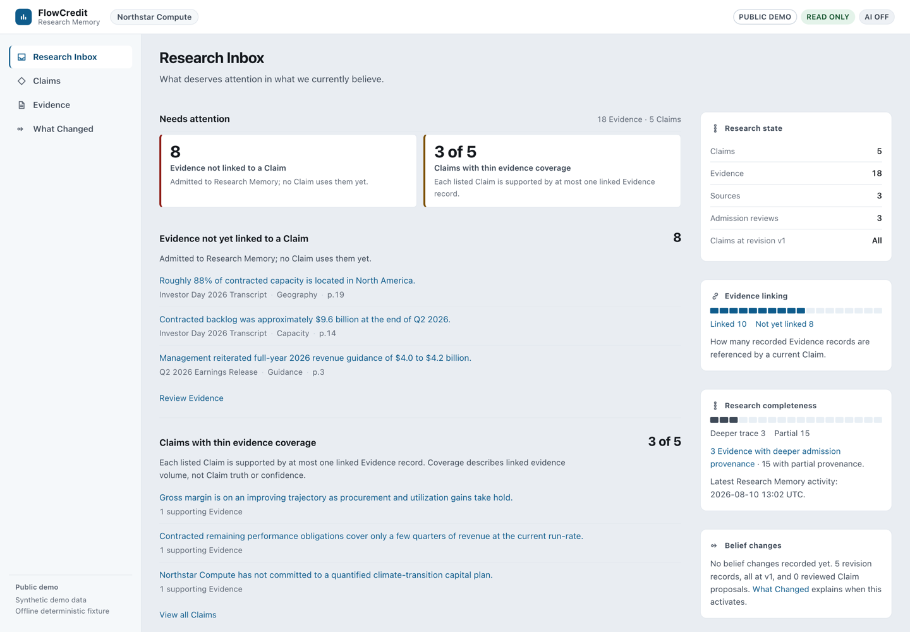

# FlowCredit Research

> Auditable belief memory and evidence reasoning for investment research.

**Research Engineering Alpha** · **Local-first** · **Human-reviewed** · **Semantic Runtime** · **Bounded Investigate Loop**

FlowCredit preserves what a research team believes, why it believes it, what new evidence changes, and what the system still needs to investigate.

> **What changed in what we believe, why did it change, and what is still missing?**

This repository is a development and testing workspace. It does not deploy a production service, autonomously revise research beliefs, or make investment decisions.

## The problem

Research systems are good at storing documents and surprisingly bad at preserving belief state.

A filing, transcript, model, note and chat thread may explain why a team believed something last quarter, but that reasoning usually dissolves into folders and memory. FlowCredit models the research state explicitly:

- **Source** — where information came from.
- **Evidence** — what was observed.
- **Claim Revision** — what the team believed at a specific revision.
- **SemanticFrame** — structured proposition and qualifiers with field-level origins.
- **RelationReceipt** — how one Accepted Evidence record relates to one specific Claim Revision.
- **Investigation Plan** — the missing context required when a safe relation cannot yet be resolved.
- **Human Review** — the authority boundary before any belief changes.

Evidence is not a Claim. A Relation is not Impact. An analytical receipt is not permission to rewrite Research Memory.

## What exists today

| Capability | Status |
| --- | --- |
| Research Memory with versioned Claims | Implemented / validated |
| Evidence admission and review boundary | Implemented / validated |
| Text and table grounding | Implemented / validated |
| Hybrid retrieval | Implemented / validated |
| Local read-only research workspace | Implemented |
| Core Proposition / Qualifier / Grounding / Field Provenance contracts | Accepted / Frozen |
| RelationInput Contract v1 | Accepted / Frozen |
| Compatibility Contract v1 | Accepted / Frozen |
| RelationInput resolver + fail-closed Compatibility gate | Implemented |
| Conservative prose/lexical Relation runtime | Implemented baseline |
| **Provenance-aware SemanticFrame runtime** | **Implemented / validated on a structured real-source benchmark** |
| **Research Memory Evidence → SemanticFrame adapter** | **Implemented / fail-closed** |
| Development RelationReceipt | Implemented baseline |
| Pairwise What Changed review candidates | Implemented |
| **Missing-context investigation planning** | **Implemented** |
| **Bounded local Evidence investigation loop** | **Implemented behavior prototype** |
| Production hybrid semantic/model Relation engine | Not complete |
| Evidence Delta / Impact | Planned |
| Automatic Claim revision | **Not allowed** |
| Persisted human review + real end-to-end What Changed | Planned |

The canonical maturity record is [docs/public/status.md](docs/public/status.md).

## The current runtime

~~~mermaid
flowchart LR
    A[Source] --> B[Grounding]
    B --> C[Evidence admission]
    C --> D[Accepted Evidence]
    D --> E[SemanticFrame]
    F[Specific Claim Revision] --> G[SemanticFrame]
    E --> H[RelationInput + Compatibility]
    G --> H
    H --> I{Relation allowed?}
    I -- no --> J[NOT_EVALUATED]
    I -- yes --> K[Relation Runtime]
    K --> L[RelationReceipt]
    L -- SUPPORTS / COUNTERS --> M[Human-review candidate]
    L -- AMBIGUOUS --> N[Investigation plan]
    N --> O[Retrieve missing comparable Evidence]
    O --> K
    M --> P[Human authority]
    P -. future .-> Q[Impact / Claim Revision]
~~~

Relation v1 remains pairwise. It does not aggregate multiple Evidence records into an Impact judgment, and neither the Relation runtime nor the investigator may mutate a Claim.

# Reality Check v0.2

The first v0.2 experiment asks a deliberately narrow question:

> **When the research record already contains explicit metric, unit, value and predicate fields, does a provenance-aware SemanticFrame path execute those facts more reliably than reconstructing semantics from prose?**

The benchmark reuses committed, reviewed CoreWeave research material:

- **3 primary publications**
- **32 reviewed Observations**
- **4 explicit numeric-predicate Claims**
- **128 Evidence × Claim pairs**
- no LLM-generated gold labels

The source set includes a 2025 Form 10-K, a Q2 2026 Form 10-Q and a Q2 2026 SEC-filed earnings release. Available document-byte hashes and source URLs remain attached to the experiment.

## Measured result

| Runtime | Exact structured-oracle match | Directional pairs correct | Unsafe directional judgments | Runtime errors |
| --- | ---: | ---: | ---: | ---: |
| Prose / lexical baseline | **66 / 128 (51.56%)** | **1 / 5 (20%)** | **8** | **2** |
| SemanticFrame runtime | **128 / 128 (100%)** | **5 / 5 (100%)** | **0** | **0** |

The experiment exposed a real robustness problem in the legacy text path: some real recorded observations caused the old Compatibility reader to fail, and eight pairs produced a directional judgment where the structured oracle did not permit one. Those failures are retained in the benchmark instead of being patched out of the comparison.

### What 128 / 128 does **not** mean

It does **not** mean FlowCredit has 100% financial-language accuracy.

This benchmark has a narrow, executable oracle based on already-recorded:

~~~text
metric
unit family
numeric value
explicit comparator / threshold
~~~

The result proves that the structured runtime faithfully executes those recorded fields on this corpus. It does not measure open-ended interpretation of management language, causal reasoning, arbitrary filings, or generalization to unseen research domains.

The directional subset is only five pairs. A much larger independently human-labeled semantic benchmark is still required.

Reproduce it:

~~~bash
node research/eval/relation-reality/cli.js
~~~

The measured artifact is committed at [research/eval/relation-reality/results.json](research/eval/relation-reality/results.json) and CI recomputes it from the underlying fixtures.

# SEC Semantic Pilot v0.2A

The structured CoreWeave benchmark proves faithful execution of recorded fields. It does not test harder open-text semantics. A separate 32-pair SEC pilot now stress-tests the lexical Relation path on Apple, Microsoft and NVIDIA filings.

| Runtime | Exact | Directional | Unsafe direction | Inversion | Ambiguous abstention |
| --- | ---: | ---: | ---: | ---: | ---: |
| Default lexical baseline | 71.88% | 78.26% | 33.33% | 4.35% | 80% |
| Isolated v0.2A candidate | **100%** | **100%** | **0%** | **0%** | **100%** |

The candidate passes the five experimental thresholds but remains isolated. The pilot is single-review, not a blind locked benchmark, and does not authorize replacement of the default runtime.

The final causal-attribution failure traced to a generic lexical bug: `H20` was read as a quantity with a missing unit. v0.2A.1 fixes embedded identifier digits only in the isolated candidate reader; no benchmark label, frozen Compatibility rule, or default baseline was changed.

Run:

~~~bash
node research/benchmark/cli.js
~~~

Archived measurements: [research/benchmark/results/real-sec-pilot-v0.1.json](research/benchmark/results/real-sec-pilot-v0.1.json).

## Blind holdout v0.2B

To test whether the 32/32 pilot generalized, the v0.2A.1 candidate was frozen and evaluated without code changes on 24 new pairs from **Amazon, Alphabet and Meta** 2025 Form 10-K filings.

| Metric | Blind holdout |
| --- | ---: |
| Exact state accuracy | **17 / 24 (70.83%)** |
| Directional accuracy | **66.67%** |
| Directional inversion | **0%** |
| Unsafe directional error | **0%** |
| AMBIGUOUS abstention recall | **66.67%** |
| Phase gate | **FAIL** |

This is the more important number for generalization. The candidate did not meet the existing promotion threshold on unseen issuers. Its strongest property remained safety: no directional inversions and no unsafe directional judgments were observed. Its weakness was under-resolution, especially causal attribution, metric binding, mix inference and second-order language.

The holdout remains locked and single-review. No label, threshold or candidate rule was changed after first evaluation. The failure is preserved at [research/benchmark/results/real-sec-blind-holdout-v0.2b.json](research/benchmark/results/real-sec-blind-holdout-v0.2b.json).

### Isolated repair replays

The locked holdout is reused only as a **repair regression set** after its first blind result. These numbers are not new blind estimates.

| Runtime | Exact | Directional | Causal attribution | Unsafe direction | Gate |
| --- | ---: | ---: | ---: | ---: | --- |
| First blind v0.2A.1 | 17/24 (70.83%) | 66.67% | 1/3 | 0% | FAIL |
| R1 causal reflection | 18/24 (75.00%) | 72.22% | 2/3 | 0% | FAIL |
| R2 causal role binding | **19/24 (79.17%)** | **77.78%** | **3/3** | **0%** | **FAIL** |

R2 adds a minimal `driver → outcome` role frame for explicit causal constructions such as `A drove B` versus `B was driven by A`. It repaired one additional archived failure and did not change the first-blind result.

### Fresh blind v0.2C protocol

The next generalization test is frozen **before source or case collection**.

- runtime: `relation-candidate/v0.2b-r2`
- base commit: `b7817dedd1c6d9b59cde15558b2036ca421c4ff7`
- 4 previously unused issuers
- 8 cases per issuer
- 32 cases total
- unchanged promotion gate
- one-shot first evaluation after dataset hash lock

Protocol state at freeze time: **`PROTOCOL_FROZEN_NO_DATASET`**.

Dataset construction has now completed under that frozen protocol:

- Costco Wholesale Corporation
- JPMorgan Chase & Co.
- Salesforce, Inc.
- Caterpillar Inc.
- 8 cases per issuer, 32 total
- dataset Git blob SHA: `5602c516d3333f1fde665738fc8385bcd7b8a6d0`

The first v0.2C run has now been executed once against the locked dataset and archived.

| Metric | Fresh blind v0.2C |
| --- | ---: |
| Exact state accuracy | **18 / 32 (56.25%)** |
| Directional accuracy | **50.00%** |
| Directional inversion | **15.00%** |
| Unsafe directional error | **16.67%** |
| AMBIGUOUS abstention recall | **25.00%** |
| Phase gate | **FAIL — all five checks** |

This is now the strongest generalization evidence in the repository, and it is negative. R2 did **not** generalize safely across the fresh cross-industry set. The prior 19/24 R2 number remains a post-failure repair replay on v0.2B, not a blind estimate.

The most serious failures are not merely under-resolution: v0.2C introduced three directional inversions and two unsafe directional judgments on non-directional gold cases. Second-order reasoning, causal hard negatives, causal attribution and insufficient-context handling are the primary observed weaknesses.

Current state: **`FIRST_BLIND_ARCHIVED_FAIL`**.

The immutable result is archived at [research/benchmark/results/real-sec-fresh-blind-v0.2c-first-run.json](research/benchmark/results/real-sec-fresh-blind-v0.2c-first-run.json). From this point onward, v0.2C is a repair/regression set, not a blind test.

# From abstention to investigation

Safe abstention is useful only if it can create a useful next action.

The frozen example remains:

~~~text
Claim:
Revenue growth is accelerating.

Evidence:
Revenue grew 40 percent in 2026.
~~~

A single growth observation still returns:

~~~text
ABSTAINED + AMBIGUOUS
RT_SECOND_ORDER_CONTEXT_MISSING
~~~

The v0.2 investigator turns that abstention into a bounded research task:

~~~text
AMBIGUOUS
  ↓
Need: PRIOR_COMPARABLE_RATE
  ↓
Find the previous comparable-period rate
  ↓
retrieve local prior Evidence: 22%
  ↓
compare 22% → 40%
  ↓
RESOLVED + SUPPORTS
~~~

The behavior test uses a controlled synthetic Northstar Evidence pool. It makes **zero network calls** and **zero model calls**. If the prior comparable value is not available, the state remains NEEDS_MORE_EVIDENCE; no direction is fabricated.

Reproduce it:

~~~bash
node research/investigate/cli.js
~~~

This is an agent-loop behavior proof, not a claim that FlowCredit can yet autonomously investigate arbitrary companies on the web.

## What Changed now has two queues

Directional evidence:

~~~text
SUPPORTS / COUNTERS
→ PENDING_HUMAN_REVIEW
~~~

Insufficient but valid evidence:

~~~text
AMBIGUOUS
→ NEEDS_INVESTIGATION
→ explicit missing-context question
~~~

Invalid or forbidden pairs remain:

~~~text
NOT_EVALUATED + null
~~~

They do not become research tasks and they do not receive a fake semantic label.

# Provenance is part of the semantics

SemanticFrame does not merely convert prose to JSON.

Each load-bearing field records how it was produced:

~~~text
CLAIM_DEFINITION
RECORDED_FIELD
DERIVED_NORMALIZATION
~~~

A future model-assisted projection must use a visibly different provenance class. Model-proposed semantics may not be silently upgraded into recorded or deterministic truth.

# Authority model

**AI and rules may propose analysis. Humans retain research authority.**

The runtime may:

- materialize structured semantics from recorded fields,
- resolve deterministic pairwise relations,
- abstain when context is insufficient,
- emit an auditable RelationReceipt,
- formulate a missing-context research question,
- retrieve bounded Evidence for an investigation,
- surface directional pairs for human review.

It may not:

- silently admit Evidence,
- mutate a Claim,
- aggregate several relations into Impact,
- produce an investment recommendation,
- hide a refusal behind NEUTRAL,
- convert missing context into confidence,
- present model-inferred semantics as recorded facts.

# Development evidence

These are engineering measurements, not production SLAs:

| Experiment | Result | Scope |
| --- | ---: | --- |
| Grounded span corpus | 7,687 | Internal research corpus |
| Hybrid retrieval Recall@20 | 1.0 | 16-case internal locked set |
| Historical hybrid relation spike | 38 / 41 | Synthetic development set |
| Compatibility gate | 29 permitted / 12 refused | Frozen 41-pair regression set |
| **Relation Reality v0.2** | **128 / 128 structured-oracle exact; 0 unsafe direction** | 3 real primary sources · 32 reviewed Observations · 4 Claims |
| Legacy text baseline on same matrix | 66 / 128 exact; 8 unsafe direction; 2 errors | Same 128 pairs |
| Investigate behavior | AMBIGUOUS → retrieve prior Evidence → SUPPORTS | Controlled local synthetic Evidence pool |

The historical 38/41 spike and the new 128-pair benchmark answer different questions and must not be conflated.

# Repository layout

~~~text
research/
  memory/               versioned Research Memory
  grounding/            source-grounded support
  admission/            Evidence admission boundary
  local-retrieval/      hybrid local retrieval
  semantic-frame/       provenance-aware structured semantic projections
  claim-relation/       RelationInput resolver + frozen Compatibility runtime/gate
  relation-runtime/     lexical baseline + structured semantic Relation path
  investigate/          missing-context planner + bounded Evidence loop
  what-changed/         review and investigation queues
  surface/              read-only local research workspace
  eval/
    relation-reality/   reproducible real-source structured correctness benchmark

docs/
  contracts/            accepted/frozen semantic contracts
  adr/                  normative architecture decisions
  public/               public maturity truth and screenshots

agent/                   legacy risk-assessment prototype and shared repository test gate
assets/                  legacy static prototype assets
~~~

The legacy agent product line remains tested for regression compatibility. It is not the current research direction.

# Test gates

From agent/:

~~~bash
npm run check
~~~

Focused research suites:

~~~bash
node --test research/claim-relation-test/*.test.js
node --test research/relation-runtime-test/*.test.js
node --test research/semantic-frame-test/*.test.js
node --test research/investigate-test/*.test.js
node --test research/surface-test/*.test.js
~~~

CI also runs the memory, retrieval, admission, analyst, grounding, evidence-support, local-model and release-verification suites.

# Next research gates

The next work is not another vocabulary layer.

1. **Audit the v0.2C safety failures before any new repair**: prioritize directional inversions and unsafe directional judgments, then isolate one failure family at a time. v0.2C is now regression-only; the next true generalization estimate must come from a new fresh holdout.
2. **Complete Claim semantic binding for real Research Memory.** Evidence now materializes directly; current prose-only Claims intentionally remain NOT_MATERIALIZED until an explicit provenance-bearing Claim projection exists.
3. Add a **verifier/model semantic route** whose proposed fields carry explicit model provenance and can never masquerade as deterministic truth.
4. Extend the investigator from the controlled Evidence pool to **bounded tool-based retrieval**, preserving as-of and source-grounding constraints.
5. Design **Evidence Delta / Impact** only after the Relation and investigation layers survive those tests.
6. Persist human review decisions and complete the real What Changed loop.

# Non-goals

FlowCredit Research is not:

- an AI stock picker,
- an autonomous trading bot,
- a generic filing chatbot,
- automatic portfolio management,
- an analyst replacement,
- a production-ready investment system,
- a system with demonstrated 100% open-ended financial reasoning accuracy.

It is research-memory and evidence-reasoning infrastructure designed so belief change can be reconstructed, challenged and investigated instead of hand-waved.

## License

MIT. See [LICENSE](LICENSE). Contribution rules live in [CONTRIBUTING.md](CONTRIBUTING.md), repository collaboration rules in [AGENTS.md](AGENTS.md), and security reporting in [SECURITY.md](SECURITY.md).
