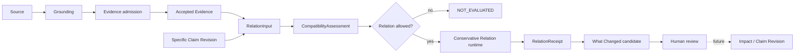

# FlowCredit Research

> Auditable belief memory for investment research.

**Research Engineering Alpha** · **Local-first** · **Human-reviewed** · **Pairwise Relation runtime available**

FlowCredit preserves what a research team believes, why it believes it, and which new evidence deserves human review.

> **What changed in what we believe, and why?**

This repository is a development and testing workspace. It does not deploy a production service and does not make investment decisions.


## The problem

Research systems are good at storing documents and surprisingly bad at preserving belief state.

A filing, transcript, model, note and chat thread may explain why a team believed something last quarter, but that reasoning usually dissolves into folders and memory. FlowCredit models the research state explicitly:

- **Source** — where information came from.
- **Evidence** — what was observed.
- **Claim Revision** — what the team believed at a specific revision.
- **RelationReceipt** — how one accepted Evidence record relates to one specific Claim Revision.
- **Human Review** — the authority boundary before any belief changes.

Evidence is not a Claim. A Relation is not Impact. An analytical receipt is not permission to rewrite Research Memory.

## What exists today

| Capability | Status |
| --- | --- |
| Research Memory with versioned Claims | Implemented / validated |
| Evidence admission and review boundary | Implemented / validated |
| Text and table grounding | Implemented / validated |
| Hybrid retrieval | Implemented / validated |
| Local read-only research workspace | Implemented |
| Core Proposition / Qualifier / Grounding / Field Provenance contracts | Accepted / Frozen |
| RelationInput Contract v1 | Accepted / Frozen |
| Compatibility Contract v1 | Accepted / Frozen |
| RelationInput resolver + Compatibility gate | Implemented |
| Conservative pairwise Relation runtime | **Implemented baseline** |
| Development RelationReceipt | **Implemented baseline** |
| Pairwise What Changed review candidates | **Implemented preview** |
| Production hybrid Relation engine | Not complete |
| Evidence Delta / Impact | Planned |
| Automatic Claim revision | **Not allowed** |
| Real end-to-end What Changed with human review persistence | Planned |

The canonical maturity record is [docs/public/status.md](docs/public/status.md).

## The runtime path


```mermaid
flowchart LR
    A[Source] --> B[Grounding]
    B --> C[Evidence admission]
    C --> D[Accepted Evidence]
    D --> E[RelationInput]
    F[Specific Claim Revision] --> E
    E --> G[CompatibilityAssessment]
    G --> H{Relation allowed?}
    H -- no --> I[NOT_EVALUATED]
    H -- yes --> J[Conservative Relation runtime]
    J --> K[RelationReceipt]
    K --> L[What Changed candidate]
    L --> M[Human review]
    M -. future .-> N[Impact / Claim Revision]
```

The dashed step is intentionally not implemented. Relation v1 remains pairwise and does not aggregate multiple Evidence records into a Claim decision.

## Run the reproducible What Changed demo

Prerequisites:

```bash
node --version   # ^22.19.0 or >=24
cd agent
npm ci
cd ..
```

Run:

```bash
node research/what-changed/cli.js research/what-changed/fixtures/northstar-demo.json
```

The committed synthetic Northstar demo exercises five pair shapes:

- one `SUPPORTS`
- one `COUNTERS`
- one `AMBIGUOUS` abstention
- one `NOT_EVALUATED` Compatibility refusal
- one `NEUTRAL`

Only the two directional receipts become `PENDING_HUMAN_REVIEW` What Changed candidates. No Impact, confidence score or Claim mutation is emitted.

## Why the abstention matters

```text
Claim:    Revenue growth is accelerating.
Evidence: Revenue grew 40% in 2026.
```

One growth observation does not establish acceleration. The runtime returns:

```text
ABSTAINED + AMBIGUOUS
reason: RT_SECOND_ORDER_CONTEXT_MISSING
```

A system that turns “40% sounds large” into SUPPORTS is not research infrastructure. It is autocomplete wearing a tie.

## Authority model

**AI and rules may propose analysis. Humans retain research authority.**

The runtime may:

- resolve deterministic pairwise relations,
- abstain when context is insufficient,
- emit an auditable RelationReceipt,
- surface a directional pair for human review.

It may not:

- silently admit Evidence,
- mutate a Claim,
- aggregate several relations into Impact,
- produce an investment recommendation,
- hide a refusal behind NEUTRAL,
- convert missing context into confidence.

## Development evidence

These are engineering measurements, not production SLAs:

| Experiment | Result | Scope |
| --- | ---: | --- |
| Grounded span corpus | 7,687 | Internal research corpus |
| Hybrid retrieval Recall@20 | 1.0 | 16-case internal locked set |
| Historical hybrid relation spike | 38 / 41 | Synthetic development set |
| Current What Changed smoke fixture | 5 pair shapes | Reproducible offline behavior test |

The historical 38/41 spike is research evidence for architecture, not a claim that the current baseline generalizes at 92.7% accuracy. The current runtime is intentionally more conservative and is covered by regression tests rather than a new accuracy claim.

## Repository layout

```text
research/
  memory/               versioned Research Memory
  grounding/            source-grounded support
  admission/            evidence admission boundary
  local-retrieval/      hybrid local retrieval
  claim-relation/       resolver + Compatibility runtime/gate
  relation-runtime/     conservative Relation baseline + RelationReceipt
  what-changed/         pairwise review-candidate preview + CLI demo
  surface/              read-only local research workspace
  eval/                 preregistered / frozen engineering evidence

docs/
  contracts/            accepted/frozen semantic contracts
  adr/                  normative architecture decisions
  public/               public maturity truth and screenshots

agent/                   legacy risk-assessment prototype and shared test gate
assets/                  legacy static prototype assets
```

The legacy `agent/` line remains tested because it contains historical contracts and the repository-wide test gate. It is not the current product direction.

## Test gates

From `agent/`:

```bash
npm run check
```

From repository root:

```bash
node --test research/claim-relation-test/*.test.js
node --test research/relation-runtime-test/*.test.js
node --test research/surface-test/*.test.js
```

CI also runs the memory, retrieval, admission, analyst, grounding, evidence-support and local-model suites.

## Current roadmap

1. Expand the Relation benchmark beyond the small internal development set.
2. Add provenance-preserving semantic projections so the runtime relies less on legacy lexical reading.
3. Add a verifier/model route behind the deterministic baseline without giving it hidden authority.
4. Design Evidence Delta / Impact as a separate audited layer.
5. Persist human review decisions and complete the real What Changed loop.

## Non-goals

FlowCredit Research is not:

- an AI stock picker,
- an autonomous trading bot,
- a generic filing chatbot,
- automatic portfolio management,
- an analyst replacement,
- a production-ready investment system.

It is research-memory infrastructure designed so that belief change can be reconstructed instead of hand-waved.

## License

MIT. See [LICENSE](LICENSE). Contribution rules live in [CONTRIBUTING.md](CONTRIBUTING.md), repository collaboration rules in [AGENTS.md](AGENTS.md), and security reporting in [SECURITY.md](SECURITY.md).
