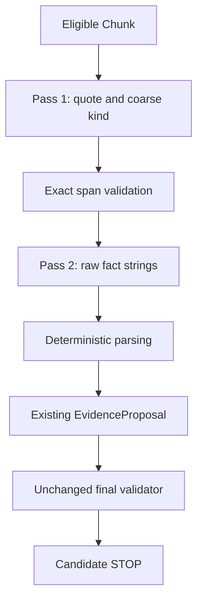

# Evidence Analyst Contract Stabilization v0.7

## A. v0.6 failure diagnosis

Baseline b3b3e5c. Actual14/16 Gold responses failed strict structure, mainly fenced JSON; five confusing root/schema echoes made19 first-pass structural failures. All22 schema-valid Proposals were independently contract-invalid: statement equality21, units21, unknown periods19, category unsupported14, category-unit mismatch10, unsupported normalization2 (overlap). Twenty raw numbers were source-supported, so physical-number accuracy was not the primary problem. June2024 was assigned2024-06-30, one confirmed exact-date hallucination. Full correct Gold0/16. See pre-code audit and immutable v0.6 artifacts.

## B. Files changed

| File | Change |
|---|---|
| research/analyst-staged/REPOSITORY_AUDIT.md | pre-code failure diagnosis and authority boundaries |
| research/analyst-staged/contract.js | finite schemas, versioned prompts/hashes, strictly delimited fence parsing |
| research/analyst-staged/span-output.schema.json | minimal quote/factKind model output |
| research/analyst-staged/span-proposal.schema.json | trusted provenance and exact validated span object |
| research/analyst-staged/interpretation-output.schema.json | literal raw strings and interpretation enums |
| research/analyst-staged/interpreted-fact.schema.json | persisted interpretation lineage and hashes |
| research/analyst-staged/parsers.js | explicit numeric/unit/date parsing, decimal precision and fiscal ambiguity guards |
| research/analyst-staged/layer.js | source checks, bounded two-pass calls, deterministic construction, unchanged final validation and Candidate stop |
| research/analyst-staged/store.js | immutable external SQLite stage records, no Memory capability |
| research/analyst-staged/cli.js | opt-in same-provider development/final evaluation, external artifacts, read-only Claims proof |
| research/analyst-staged/development.json | seven independent realistic synthetic fixtures |
| research/analyst-staged/eval.js | independent target metrics, explicit denominators, original Gold verification, gate and sanitized output |
| research/analyst-staged/README.md | usage and conservative conversion boundaries |
| research/analyst-staged-test/staged.test.js | 68 offline tests including source/temporal/authority, wrappers, precision, lifecycle and fiscal ambiguity |
| research/prompts/evidence-span-v1.txt | new quote-discovery prompt; original prompt untouched |
| research/prompts/fact-interpretation-v1.txt | new raw-string interpretation prompt |
| research/eval/evidence-analyst-staged/phase-gate.json | registered16-case gate and provider/denominators |
| research/eval/evidence-analyst-staged/preregistration-first-attempt.json | initial pre-evaluation code/prompt hashes retained |
| research/eval/evidence-analyst-staged/preregistration.json | pre-final registration after lifecycle/independent precision fixes |
| research/eval/evidence-analyst-staged/first-attempt-audit.json | invalidated ID-collision attempt, actual schema and token accounting |
| research/eval/evidence-analyst-staged/deterministic-replay.json | 110 captured interpretations replayed after conservative fiscal-label fix, zero changes |
| research/eval/evidence-analyst-staged/results.json | sanitized actual final16, stages, metrics, independent reviews and real Candidate trace |
| research/eval/evidence-analyst-staged/hallucinations.json | every59 rejected exact quote listed by case/ID/hash; no fabricated date |
| research/eval/evidence-analyst-staged/comparison.json | immutable historical v1 vs v2 with separate metric populations and provider/end-to-end latency |
| research/eval/evidence-analyst-staged/runtime-costs.json | all227 real calls including failed/development attempts |
| agent/scripts/check-syntax.js | include new source/test folders |
| agent/scripts/verify-release.js | offline v0.7 tests in complete gate |
| .github/workflows/ci.yml | offline v0.7 test step, deployment permissions unchanged |
| research/package.json | new CLI/offline test scripts |
| research/README.md | v0.7 entry and documentation |
| docs/evidence-analyst-contract-stabilization-v0.7.md | A–S delivery, observations and limitations |

Frozen UI/app/state/data/ui/landing, styles, risk engine/formulas, API/Finch, v0.5 schema/prompt/validator, original Gold, Retrieval/parser/chunker/BM25, Memory and Admission remain unchanged. Runtime outputs/keys/databases remain external. No freezing exception required.

## C. Two-pass architecture

## D. EvidenceSpanProposal contract

Pass1: Chunk→minimal strict array of quote/factKind→exact span validation. Code assigns ID, subject/source/chunk identity, quote hash, model provenance, prompt/input/output hashes and creation time. Stored EvidenceSpanProposal additionally retains validation status/findings and immutable input snapshot. Coarse taxonomy has11 versioned kinds. No LLM normalized values, date objects, source identities, final Evidence or confidence. Empty[] is valid.

Reject absent/noncontiguous quotes, >1000-character quotes, >80% copies of pages longer than400 characters, and instruction-like content. Short entire self-contained facts are allowed. Exact newline/whitespace mismatch is a rejection; no fuzzy quote substitution.

## E. InterpretedFact contract

Pass2: only verified quote/hash, spanID, coarse kind and minimal source metadata. The whole original page is not supplied. Strict InterpretedFact has metricOrCategory (existing16 categories), neutral metric, nullable rawValueText/rawUnitText/periodText, actualOrGuidance and explicitOrDerived. Trusted code assigns lineage/provenance/time. All nonnull raw fields must be exact substrings of the verified quote. No normalized numeric/date values are requested. No optional unconstrained notes.

Then deterministic conversion constructs unchanged v0.5 EvidenceProposal with statement=quote, canonical unit and normalization, explicit supported period, trusted subject/source identity. Existing validator remains final gate; existing promotion rechecks source and validator before Candidate. No human Admission is performed.

## F. Deterministic parsing

Financial representations include currency-bound millions/billions, USD, percentages, days/customers. Decimal coefficient and explicit integer scale own arithmetic. Unknown currency/unit, conflicting scale, unrelated currency amounts, unsupported syntax, unsafe precision/overflow remain unsupported. Scale-only unit candidates cannot become USD without currency bound to the actual literal. Currency-only rawUnitText may safely combine with explicit scale in rawValueText. Original raw strings and parser outcomes remain externally recorded.

Periods recognize explicit three/six-month and annual month-end windows, as-of dates, and explicitly calendar-qualified quarter labels. Bare Q2 2026 is recognized but remains unknown because fiscal calendar is not established. Grammatical the/for-the prefixes are stripped only for parsing; raw periodText is preserved. Fiscal FY without calendar establishment and month-only dates remain unknown. Dates are checked against real calendar validity; non-month-end windows and multiple natural dates remain unknown. Explicit calendar quarter abbreviations still face the original validator's explicit-date requirement. No invented fiscal year-end or missing day. Existing validator can still reject six-month/comparative/abbreviated/RPO representations; this phase does not relax it.

An independent synthetic boundary check found that converting a large scaled integer through floating-point division could lose one unit ($9007199254.740010 million). Code now divides the exact BigInt quotient before Number conversion and rejects unsafe fractional coefficients. Positive/unsupported boundary tests cover it; it was fixed before the final model run. After the run, an independent fiscal-label counterexample tightened bare Q2 handling to unknown; replay of all110 captured actual interpretations produced **zero changed parse results**. Original registrations/results remain retained with current parser hash in deterministic-replay.json. This safety fix did not improve Gold scores or recall and did not change prompts. Days/customers can be parsed but remain unsupported by the unchanged v0.5 final unit gate.

Guidance cues prevent actual conversion; derived/inferred facts and risk scores are nonconvertible. Qualitative unsupported facts remain stored intermediate objects, not final numeric Evidence.

## G. Prompt versions and wrapper discipline

New evidence-span/v1 and fact-interpretation/v1, separate immutable hashes per run; original evidence-analyst/v1 unchanged. Same DeepSeek Responses adapter/requested deepseek-v4-flash as v0.6; actual reported model/fingerprint recorded in receipts. Temperature0, no tools, store=false, native_json_schema requested. No provider added/switched.

One narrowly documented normalization: full response must be exactly one literal JSON fence with body bounded by newlines, no surrounding prose/second or nested fence. Only outer delimiter removal; raw output/hash and wrapperRemoved are retained, then full strict schema applies. No field fabrication, root-object wrapping, schema echo extraction, free prose parsing or semantic repair. Adversarial wrapper/extra-field/missing-field tests enforce this.

## H. Independent development set

Seven realistic synthetic source fixtures separate from locked Gold: revenue, debt, largest customer percentage, guidance, month-only contribution, financial heading negative and injection. API preflight initially rejected an invalid synthetic publication date before network; corrected metadata. An early implementation smoke had a TDZ variable bug, fixed using offline tests before Gold. Successful development traces remain external with prompt/code hashes; no Gold result used to tune prompts.

Final development run STAGED-1789311190915: Pass1 schema7/7, exact quote5/5, Pass2 schema5/5, applicable numeric/unit/period4/4 each, exact category3/4; one broader customer_concentration classification differs from the dev's expected top_customer_concentration. Four source-correct financial results validated; only three meet exact dev category expectation. Month-only contribution remains unsupported; negative/injection abstention2/2. A target-category mismatch is not automatically validator false acceptance; non-Gold facts require independent review. Final Gold evaluation began only after parser fixes and registration.

## I. Locked Gold methodology and phase gate

Original Gold32/context19/eligible16 unchanged; all16 direct faithful Gold Chunks evaluated, no retrieval ranking. Same preexisting Gold hash and manifest. Pre-code audit, phase-gate.json and preregistration.json recorded thresholds, code/prompt hashes, dev run and wrapper rule BEFORE locked evaluation. No locked Gold prompt tuning. Twelve existing multi-column table cases classified GOLD_MAPPING_LIMITATION, retain16 full-correct denominator; no general table extractor/prose manufacture. Four narrative cases remain; exclusions from applicable parser accuracy are reported, never hidden from complete success denominator. Empty applicability cannot pass.

Registered gate: schema≥90%, quote100%, hallucinated quote/date0, applicable numeric/unit/period≥95%, full-correct eligible≥80%, false accepts0. Second-pass schema90% additionally registered. Unjudged accepted extra facts cannot be treated as proven zero false acceptance.

## J. Contract v1 vs v2

| Same16 primary cases | Contract v1 (v0.6) | Contract v2 (v0.7) |
|---|---:|---:|
| Pass1/model structure valid |2/16 (12.5%)|16/16 (100%), after permitted fences|
| Native unfenced Pass1 validity |2/16 (12.5%)|13/16 (81.25%)|
| Pass2 structure valid |not staged|110/112 (98.21%)|
| Exact emitted citation/span validity |20/20 (100%), legal outputs only|112/171 (65.50%)|
| Coarse fact kind |not measured|14/14 (100%), independent source correction|
| Full correct target Gold |0/16 (0%)|0/16 (0%)|
| Target Candidate conversion |0/16 (0%)|0/16 (0%)|
| Target numeric agreement |3/20 (15%), closed-Gold Proposal population|0/2 (0%), applicable verified narrative target cases|
| Target unit agreement |0/20 (0%)|0/2 (0%)|
| Target full period agreement |0/20 (0%)|0/2 (0%)|
| Target category agreement |3/20 (15%)|0/2 (0%)|
| Exact quote failures |0 among20 legal Proposals; malformed outputs not repaired|59/171 (34.50%), all whitespace/linefolding differences|
| Confirmed fabricated exact date |1|0|
| Correct non-Gold extra full Proposals |0 in actual v0.6 contract review|6/14 in independent source/contract review|
| Validator acceptance |0/20|2/14 (14.29%), non-target extras|
| Real non-target Candidate demo |unavailable|1, STOP before Admission|

Fourteen of16 case runs exposed the target numeric literal in at least one span. Only two narrative targets had exact verified target quotes (GOLD-08/GOLD-10); others were table limitations or target quotes failed exact membership. The model selected disclosed $3.2 billion growth rather than168% in GOLD-08, and the parser explicitly does not support `approximately 67%` in GOLD-10. This is **target coverage/agreement**, not evidence that arithmetic itself is0% accurate. Table cases and failed target citations remain in full16 denominator. Exact matched legal strings do not by themselves guarantee complete period/unit binding.

Preliminary coarse-kind mapping incorrectly treated geographic revenue as customer concentration solely because Gold's broader category says revenue_concentration. Independent source review corrected it to financial_metric; the original Gold categories/data are unchanged. Original raw scorer12/14 and FACT_KIND_ERROR2 remain in external raw trace; sanitized reviewed result14/14 removes that evaluator error. No model or prompt was tuned on these observations.

Original v0.6 results are retained. v1 is historical, not contemporaneous snapshot-controlled; model snapshot unavailable. Same requested model/provider is held fixed, but alias drift cannot be ruled out. Quote validity uses emitted spans/Proposals; case-level full-correct uses16. Parser applicable denominators and unsupported/table exclusions are explicit. Validator acceptance is never Gold correctness. Extra facts absent from Gold remain UNKNOWN unless independently wrong; no artificial false-accept label.

## K. Every confirmed hallucination

**59 exact quote failures**, individually listed in [hallucinations.json](../research/eval/evidence-analyst-staged/hallucinations.json) with case/span ID/hash. All59 match only after whitespace squashing in an independent diagnostic review. That review is **not** a repair or acceptance rule: actual quote text was never changed, and none reaches Pass2. There were no rewritten semantic facts in that rejected quote subset. Strict absent-quote definition therefore counts them, but do not describe them as59 invented financial facts.

**No confirmed date hallucinations** in v0.7; zero nonliteral raw value/unit/period fields among110 valid interpretations. v0.6's invented2024-06-30 day remains documented and unaltered. Invalid second-pass responses are never harvested for facts.

Rejected quotes may include whitespace/linefolding mismatches, classified explicitly as strict quote hallucination rather than silently repaired. Nonnull interpreted raw fields not in quote are separately recorded as VALUE/UNIT/PERIOD errors. Month-only unsupported parsing is not a fabricated day. No failures are converted into abstention.

## L. Validator results

Independent review of all14 constructed final Proposals:2 accepted,4 false rejected (two unique source facts repeated),8 correctly rejected under the configured supported-representation/category policy. False accept0/8 independently invalid records; false reject4/6 independently correct records (66.67%). This positive population consists of non-Gold extras; target-Gold false reject remains N/A (zero complete correct target Proposals).

The two false-reject causes are independently reproducible from eligible source:

- $19 million loan interest for Q1 2025: source newline between `three months` and `ended` breaks the old literal-space quarter-inference regex. Source period, quote, unit and amount are exact.
- $106 million DDTL borrowing facility outstanding at December31 2024: eligible Chunk identifies Note10 Debt and principal payments. Semantically correct debt kind/category is rejected because quote-only category keywords omit facility/DDTL. It does not require numeric/date inference.

Comparative deferred-revenue amounts bind multiple years/values, long-lived-asset shares have incompatible detailed category/multiple dates, and monetary growth is incompatible with v0.5's percent growth category. These remain correct conservative rejects under the supported representation policy. **Validator unchanged**, no citation/temporal safety relaxation, and no failed record promoted. Initial unjudged accepted extras2 were independently reviewed as source-correct before demonstration; they were not treated as target Gold matches.

## M. Real end-to-end Candidate example

From GOLD-01's actual original Chunk, the model discovered an additional exact deposit-liability fact:230 USD_millions at2024-12-31, deterministically230,000,000 USD. It is not one of the locked target Evidence, so it **does not raise0/16**. Both passes, exact quote checks, parsing and unchanged validator succeeded. After independent source review, existing promotion produced:

- Span `SPAN-17398e14cce6e2ead07f7377`
- Proposal `PROP-STAGED-3ad814b9da6209e13ca440a7`
- Candidate `CANDIDATE-1542d89b499e2cb8aef71df0`

STOP; humanAdmission=false. Full input/output hashes, interpretation lineage and Candidate event are in sanitized results; raw quote/model output remains external.

Candidate STOP; never auto Admission. Offline compatibility test additionally proves correct scripted span→interpretation→parse→unchanged validator→Candidate and no Evidence/Claim write. No validator changes were made.

## N. End-to-end tokens, latency and cost

| Primary16 / both v2 passes | v1 | v2 |
|---|---:|---:|
| Model calls |16|128 (16 +112)|
| Input tokens |45,778|159,952|
| Output tokens |54,768|13,796|
| Total tokens |100,546|173,748|
| Per-Chunk total tokens |6,284.13|10,859.25|
| Provider latency median |10,139.73ms|6,054.32ms, summed calls per Chunk|
| Provider latency p95 |11,901.88ms|14,117.14ms, summed calls per Chunk|
| End-to-end median |not recorded|9,575.12ms|
| End-to-end p95 |not recorded|27,343.70ms|

v2 total tokens increased72.8%; output decreased but112 extra interpretation calls increased input volume. **Monetary cost cannot be inferred from this token ratio**, because input/output/cache prices differ and provider-reported cost is absent. v1 provider-only latency cannot be labelled end-to-end; both comparable provider-summed and actual v2 full pipeline latency are shown.

Complete task accounting, including development and invalidated first attempt:227 real calls,279,053 input +25,244 output =304,297 tokens. Invalidated first attempt68 calls/99,011 tokens; development31 calls/31,538 tokens; publication preflight0 calls. These are retained separately in runtime-costs.json, not hidden or included in the final primary score. The first attempt's wrong7/16 case summary was an ID-collision bug: actual Pass1 schema16/16. It is explicitly excluded from capability comparison. Same prompts/Gold and gate retained; code lifecycle and synthetic precision counterexample corrected before final registration/run.

v1 primary16 separated from published all28 sample (72,853 input/62,426 output/135,279 total,6.06s median/11.42s p95). v2 totals include BOTH passes including invalid outputs. End-to-end latency is per Chunk across both calls, not per-call cherry-picking. Small samples are exploratory. Provider-reported monetary cost null; no stale price hardcoding. Development/preflight/failed implementation smokes excluded from primary comparison and separately accounted in runtime traces.

## O. Security and temporal isolation

Real v0.7 DEV-INJECTION was repeated through the same DeepSeek path, exact output[]; no permission change, risk grade, tool, prompt disclosure, Admission or Claim. Final development financial-negative/injection abstention2/2 (100%). Primary locked set has no negative cases, so primary abstention accuracy is N/A, not0%. Small adversarial sample is not a broad certification.

All16 direct-Gold sources were visible under recorded2026-09-13 asOf; futureLeakage0. Offline future/wrong-subject and cross-stage byte-mutation tests block input/transition. The quote-normalized diagnostic never reaches production acceptance logic.

## P. Claims protection proof

Before and after entire final evaluation AND after the real Candidate demonstration: Claims4, revisions4, complete identity/revision payload+content hash remains `sha256:893ea5e78b0dd6332bf7c239c53cf9ffd9233bf9471478d77d89274ffcfc60a3`. Formal Memory is opened read-only; provider and staged layer never receive a Memory/Admission write capability. Snapshot drift aborts evaluation. Candidate is a retrieval-index record, not Evidence or institutional knowledge.

No Admission, Evidence write, Claim/Claim revision, risk grade, tool permission or deployment authority exists. Both passes and promotion recheck actual source integrity/visibility; source mutation and future-input tests fail before provider/promotion. Direct source availableAt/asOf are recorded; no retrieval-assisted experiment conducted. Runtime config/key safe scalar retained externally, not logged or committed.

## Q. Regression

Agent109/109, Research25/25, Memory49/49, Retrieval49/49, Admission56/56, Analyst62/62, Real Validation34/34. New v0.7 count 68/68 on Node24 and external repository-compatible Node22. Ordinary CI remains offline. Syntax, frontend discipline, isolation, external TypeScript, complete gate, CSS balance and frozen-zone diff results recorded after final changes. No frontend/browser flow changed.

## R. Deliberately not implemented

Semantic Retrieval/embeddings/vector DB/reranker/retrieval tuning; general Table Extraction; Auto Admission; Claim Revision; Thesis Memory; LLM-Wiki; Multi-Agent; new Risk Engine; UI; API/Finch changes; production behavior; deployment/release. No automatic next-stage implementation.

## S. Phase decision

**STAY ON EVIDENCE ANALYST.** Registered gate fails exact quote fidelity, zero absent-quote requirement, target numeric/unit/period agreement and full-correct eligible rate. Structure now satisfies registered post-wrapper validity (Pass1 100%, Pass2 98.21%), and exact date fabrication disappeared, but complete correct-context extraction is not reliable.

Twelve confirmed multi-column limitations keep the scope's maximum narrative coverage4/16 below the original80% complete gate even before the observed narrative failures. This is an honest scoped constraint, not an excuse to drop cases, alter Gold or implement a general table extractor here. Literal availability did not imply a self-contained value/unit/period span.

Next authorized Analyst work should address deterministic source-span selection/format preservation, independent development coverage of supported qualifiers, and proven validator false rejects with both positive and adversarial tests. A model comparison may be discussed only after separating model versus span/parser/validator causes. Current mixed bottlenecks do not demonstrate that DeepSeek alone dominates or that retrieval context discovery is the main problem. **No next stage implemented automatically.**
