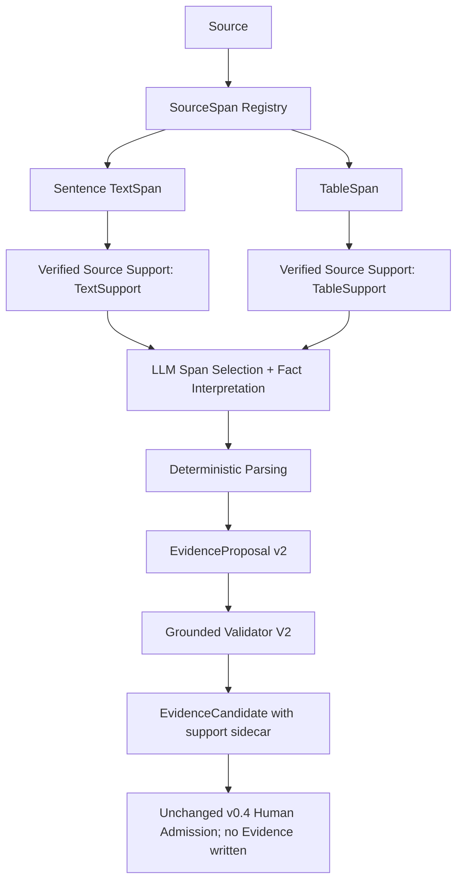

# FlowCredit Evidence Support Contract v0.9

Baseline `3997a77` (Source Grounding Layer v0.8). v0.8 removed fabricated citations from span
selection but ended on `STAY ON SOURCE GROUNDING`: the frozen v0.5 contiguous-quote validator
refused every table fact because the unit and the period live outside any cell quote, block-level
text spans held several facts each, and Candidate conversion was 0 of 16. v0.9 builds two legal,
auditable evidence support paths without lowering any truth, provenance or validation strength:

```text
Text facts  require exact textual grounding.
Table facts require exact structural grounding.
Never fabricate prose to make a table fit a text contract.
```



## A. Pre-code audit

Full answers in `research/evidence-support/REPOSITORY_AUDIT.md`, written before any code. It read
the v0.1 Evidence schema and identity rules, v0.2 Memory persistence and correction/supersession,
v0.3 Candidate contract and chunker, v0.4 admission boundary, v0.5 validator, v0.6 real validation,
v0.7 EvidenceSpanProposal, v0.8 SourceSpan/TableSpan registry, renderer, and false-reject records,
plus the locked 16 Gold cases and the v0.8 artifacts. Corpus confirmation on the locked corpus:
12 table cases are groundable from a single core cell plus its verified context (no case needs
multi-cell composition), 4 text cases become groundable only with sentence spans, and the 11 v0.8
false rejects are 10 table plus 1 text. Locked Gold truth was not changed.

## B. Existing continuous-quote assumptions

The v0.1 schema has no quote field, but four of its fields are quote-shaped by convention and by
every producer, and the assumptions live in four layers:

| Assumption | Layer | Site |
|---|---|---|
| `quotedText` must be an exact substring of a chunk; Candidate identity is query/quote-driven | Candidate v0.3 | `validateCandidate` → `quote_not_in_chunk`; `createCandidate` |
| `statement === quotedText`; value, unit words and period text must appear inside the quote | Validator v0.5 | `statement_not_exact`, `numeric_unit_binding_invalid`, `unknown_or_unsupported_unit`, `period_not_supported` |
| raw value must appear in the reviewed quote; statement is the candidate quote | Admission v0.4 | `mapCandidate` → `rawPresent` |
| a best-effort contiguous quote can represent a table fact | Grounding v0.7/v0.8 producers | `validateSpan` quote rules; `sourceQuote` + `deriveSpanFact` |

Measured consequence in v0.8: 10 of 10 selected table cases were `VALIDATOR_FALSE_REJECT` even
though value, unit and period parsed exactly to locked Gold. That is a representation failure, not
a model failure, so v0.9 fixes the representation and keeps every validator strict.

## C. Files changed

| File | Change |
|---|---|
| research/evidence-support/REPOSITORY_AUDIT.md | pre-code audit answering the six required questions |
| research/evidence-support/sentences.js | deterministic `sentence-segmentation/v1` SentenceTextSpan index with verification |
| research/evidence-support/support.js | `source-support/v1` TextSupport/TableSupport union, TableIndex, immutable support hashes |
| research/evidence-support/validator.js | `grounded-evidence-validation/v2`: common checks plus text and table branches |
| research/evidence-support/proposal.js | EvidenceProposal v2 build and provenance helpers |
| research/evidence-support/{schemas,proposal-v2.schema.json,selection-output.schema.json} | versioned proposal v2 and selection schemas |
| research/evidence-support/contract.js | span-selection/v2 and fact-interpretation-span/v2 prompts, strict parsers, test provider |
| research/evidence-support/layer.js | EvidenceSupportAnalyst: candidates → selection → verification → interpretation → deterministic parsing → proposal → candidate promotion (identity salt hardened, see P) |
| research/evidence-support/{store,gold,eval,controls,cli}.js | immutable support store, Gold v2 annotation, metrics and gate, control workspace, opt-in CLI |
| research/evidence-support/synthetic-pdf-v2.py | byte-stable hostile control document (real values + placeholder twin cells, hostile narrative) |
| research/evidence-support-test/* | 39 offline tests (sentences, support, validator, layer, promotion regression) |
| research/prompts/span-selection-v2.txt, fact-interpretation-span-v2.txt | frozen prompt texts for this phase |
| research/eval/evidence-support/phase-gate.json | pre-registered gate (unchanged after registration) |
| research/eval/evidence-support/{results,comparison,false-rejects,injection,runtime-costs}.json | sanitized v0.9 artifacts; no raw model literals |
| docs/evidence-support-contract-v0.9.md | this document |
| research/README.md, research/package.json, .github/workflows/ci.yml, agent/scripts/check-syntax.js, agent/scripts/verify-release.js | registration and CI wiring for the new offline suite |

Frozen and untouched: assets/, agent/src (risk engine), the v0.5 validator, the v0.3 Candidate
schema, the v0.4 admission boundary, the v0.8 registry/parser and the locked Gold file.

## D. SourceSupport architecture

`SourceSupport` is an explicit union instead of "support == quote string". A support is built by
deterministic code from a verified span, frozen, and hashed; the model never writes span text,
labels, unit or period. Versions: `sentence-segmentation/v1`, `source-support/v1`,
`grounded-evidence-validation/v2`, `span-selection/v2`, `fact-interpretation-span/v2`, layout
`pdf-layout-spans-pymupdf-1.26.5/v1`, grounding `source-span-registry/v1`.

## E. Sentence TextSpan

`sentences.js` slices each verified block TextSpan into deterministic sentence spans: parents and
offsets are preserved, ids are stable across rebuilds, hashes are verified, punctuation is kept
byte-exact, and no LLM segments anything. Guards cover abbreviations (`U.S.`), decimals and dollar
amounts (`$1.21`, `1,210`), semicolons and colons, parenthetical sentences and enumerations, and a
block without a reliable boundary falls back to one whole-block sentence rather than guessing.
The locked corpus yields 7,068 sentence spans over the 4,087 block text spans; block spans remain
and every sentence verifies against its parent chain.

## F. TableSupport

`TableSupport` states that one real table cell, in its real row/column/unit context, expresses a
fact. It carries `tableId`, `spanId`, `page`, `rowIndex/columnIndex`, `rowLabel`, `headerPath`,
`cellText`, `unitContext`, `tableTitle`, parser/grounding versions and `cellHash`/`supportHash`.
Deterministic code owns the fact fields: value from `cellText` (`bindingLiteral` → `parseNumeric`),
period from the column label/header path (`spanPeriodText` → `parsePeriod`), unit from the unit
context; the model returns null raw fields for tables. A bare `FY`/`Q2` label without a fiscal
calendar stays `unknown`. The renderer exists only for model display, debugging and evaluation; it
is never source truth, and no path reconstructs prose from a table. Multi-cell composition
(`supportSpanIds`) is deliberately not implemented; no locked case needs it.

## G. EvidenceProposal compatibility strategy

v0.9 adds `EvidenceProposal v2` whose `support` is the union; v1–v8 records, ids, hashes and the
quote convention stay readable and verifiable exactly as stored, with no data migration. Promotion
creates a `supportCandidate` sidecar (`SCAND-…`, `admissionRequired: true`, `evidenceWritten:
false`) that wraps an ordinary retrieval Candidate (the verbatim anchor is only a retrieval
anchor), and the v0.4 human admission boundary is unchanged: no table or text fact becomes
Evidence automatically.

## H. Grounded Validator V2

`grounded-evidence-validation/v2` runs common checks (source, document, subject, hashes,
`availableAt`, span existence, span hash, immutability) and then a text branch (exact sentence
slice, offsets, text hash, parent source) or a table branch (table, row, column, cell, exact
`cellText`, `rowLabel`, `columnLabel`/header path, unit context, page, table/source/content
hashes). Any mismatch rejects. The v0.5 validator is frozen and still guards v0.1–v0.8 text
evidence; nothing was deleted, no fuzzy match or paraphrase path was added, and a tamper suite
proves false accepts are structurally impossible (0 in both real runs).

## I. Deep provenance

Text evidence resolves `Evidence → Support → SentenceSpan → BlockSpan → Document → Source`; table
evidence resolves `Evidence → Support → TableSpan → row/column/cell/unit context → Document →
Source`. Both are queryable from the stored proposal, support, candidate sidecar and admission
records; `admissionRequired` and `evidenceWritten:false` keep the boundary explicit.

## J. Locked Gold composition

Annotation `gold-span-annotation/v2` keeps locked Gold truth and adds grounding only
(`expectedSupportType`, `expectedSpanIds`): 4 text cases (GOLD-05/06/08/10) map to sentence spans,
12 table cases map to verified cells, 0 remain unsupported, coverage is 16/16, and all 12 legacy
table-column cases are now table-groundable. `goldHash sha256:c5d78e91…` is unchanged and the gate
hash was registered before the locked run.

## K. v0.8 vs v0.9 benchmark

```text
                                   v0.8            v0.9 (final run)
target selection                14/16  0.875     14/16  0.875
fabricated support               0/153           0/158
source support fidelity        153/153 1.000   158/158 1.000
table structural fidelity         n/a          98/98   1.000
numeric accuracy                 11/14 0.786    12/14 0.857
unit accuracy                    11/14 0.786    12/14 0.857
period accuracy                  13/14 0.929    13/14 0.929
chain correct                     0/16           8/16
candidate conversion              0/16           16/16
validator false rejects           11             0
validator false accepts            0             0
wrong support selections         137            144  (non-target selections)
```

The registered gate: 6 of 9 items pass (fabricated support, source support fidelity, table
structural fidelity, false accepts, candidate conversion, false rejects). Numeric (0.857), unit
(0.857) and period (0.929) fall below the pre-registered 0.95 bar because two of the four text
cases copied compound literals from their sentence (`"$30 million and $61 million"`,
`"$3.2 billion, or 168%"`), which deterministic parsing correctly refuses, and because 2 of 12
table targets were not selected. Those are semantic errors, not contract errors: table parse
fidelity on selected targets is 10/10 for value, unit and period. Full numbers:
`research/eval/evidence-support/{results,comparison,false-rejects}.json`.

## L. The 11 v0.8 false rejects

Each v0.8 false reject was replayed per case (`false-rejects.json`):

```text
Resolved by TableSupport:        9   GOLD-01,02,03,07,09,11,12,14,16
Resolved by sentence spans:      1   GOLD-05
Contract-resolved, selection miss: 1 GOLD-13 (its target cell was offered but not selected)
Still false rejected:            0
```

GOLD-13's v0.8 finding was a contract limitation like the others; in v0.9 the contract accepts its
support, and the case fails for a different, semantic reason (the model picked another cell).

## M. Table metrics

```text
Table Gold cases:            12
target selected:             10/12
value accuracy:              10/10 (selected)
unit accuracy:               10/10
period accuracy:             10/10
category (fact semantics):    6/10
chain correct (all of above):  6/12
candidate converted:         12/12
```

Every selected table cell bound its exact structural context; every promoted table fact carries
its structural support; no case needed multi-cell composition and no value was guessed by the model.

## N. Text metrics

```text
Text Gold cases:              4
target selected:              4/4
value accuracy:               2/4   (GOLD-06 and GOLD-08 refused compound literals)
unit accuracy:                2/4
period accuracy:              3/4
chain correct:                2/4
candidate converted:          4/4   (GOLD-06 and GOLD-08 end at a Candidate via another validated fact)
```

Sentence spans resolved the v0.8 block-granularity problem for GOLD-05 and GOLD-10 (both now
chain-correct); the two remaining failures are the compound-literal interpretation class that the
deterministic parser must continue to refuse.

## O. Fabricated / wrong support metrics

Fabricated support stays 0 of 158 selected spans: a model output that is not in the supplied
candidate set is rejected before interpretation (`FABRICATED_SPAN`, 0 this run; `INVALID_SPAN_REFERENCE`
pinned by tests). `WRONG_SUPPORT_SELECTION` counts real, verified spans that do not support the
adjudicated fact (144 non-target selections; two cases missed their target entirely). Wrong
support is a semantic model error and is reported separately from fabrication, never merged.

## P. Candidate conversion

Every locked case now ends at an `EvidenceCandidate`: 16/16 versus 0/16 in v0.8. Twelve of those
are the annotated fact itself (the other four cases promoted a different validated fact because
the model mis-selected or mis-interpreted the target). The first registered run exposed a latent
promotion defect inherited from the v0.5 identity salt (a fact digest appended to the retrieval
query as ordinary text pushed one- and two-word table anchors below the frozen BM25 queryCoverage
threshold, so `createCandidate` refused the anchored chunk for GOLD-02/11/14/16). The fix encodes
the digest as a punctuation identity salt that `tokenize()` never sees, so query identity and
Candidate identity still differ per fact while lexical relevance is unchanged; the sanitized
record is amendment 1 in `results.json`, the gate file and thresholds were not touched, and the
benchmark was re-executed as the final run. Target promotions were replayed offline against the
session store: 12 succeeded (idempotent with the run), 2 were correctly refused
(`Fact not validated`), 2 had no target proposal. Human admission remains required and no Evidence
was written.

## Q. Security

A real prompt-injection run over the deterministic hostile control document: page 2 holds a
hostile instruction inside an ordinary paragraph, page 1 a hostile table row label with real
values plus a placeholder-only twin cell. The model selected 0 injected spans, fabricated 0 ids,
and produced 0 forbidden-judgment findings; the placeholder-only cells were excluded from all
candidates before the model call; the hostile labels stayed verified data. Span content is data:
the provider payload has no tools (`tools: []`, `tool_choice: 'none'`), the layer holds no Memory
or Admission write capability, and nothing in the run modified Claims, risk or secrets. Details:
`research/eval/evidence-support/injection.json`.

## R. Claims protection

The formal Memory database is opened read-only. Before and after all three real runs (gold before
the fix, final gold, injection) the snapshot is identical: 4 Claims, 4 revisions, payload hash
`sha256:893ea5e7…`. Snapshot drift aborts evaluation; a Candidate remains a retrieval-index record,
not Evidence.

## S. Token / latency

```text
v0.8 gold             169 calls  240,038 input + 14,351 output = 254,389   median 10.08s  p95 11.72s
v0.9 gold (pre-fix)   170 calls  255,437 input + 13,388 output = 268,825   median  9.78s  p95 11.23s
v0.9 gold (final)     174 calls  260,487 input + 13,778 output = 274,265   median  9.73s  p95 12.05s
v0.9 injection          6 calls    7,645 input +    335 output =   7,980   median 0.76s   p95 0.97s
```

Sentence-level context keeps the input bill close to v0.8 (260k versus 240k input tokens over the
same 16 cases) because each case still sends one bounded page context. Provider-reported monetary
cost is null and no stale price is hardcoded. Latency is an exploratory 16-sample measurement.

## T. Regression tests

39 new offline tests in `research/evidence-support-test` cover sentence segmentation guards,
parent linkage and stable ids/hashes, text and table support construction and tamper rejection,
support subject/version binding, table value/unit/period parsing, the guidance assertion window,
bare-date and recognition-clause boundaries, proposal validation, promotion (including the new
short-anchor regression, salt tokenization-invisibility and per-fact Candidate identity), hostile
label handling, placeholder exclusion, and the injection boundary. Full gate after all changes:
syntax 156 files, frontend discipline, dev isolation, every offline suite (bridge 25, memory 49,
retrieval 49, admission 56, analyst 62, real validation 34, staged 68, grounding 32, evidence
support 39), the public API and Finch contracts, and `verify-release.js` end to end.

## U. Deliberately not implemented

Model comparison and local-model migration (the phase variable had to stay the support contract);
semantic retrieval, embeddings, vector DB, reranker or retrieval tuning; Claim revision, Thesis,
LLM-Wiki, Multi-Agent or any Research Risk Engine; derived-fact promotion (explicit only); fiscal
calendars (bare `Q2`/`FY` labels stay unknown); multi-cell fact composition; UI work; deployment or
release. No next stage was started automatically.

## V. Next step decision

**GO TO MODEL COMPARISON.**

The recommended next stage is model comparison, because the evidence support contract is now stable
while the remaining failures are DeepSeek semantic errors: fabrication 0, source fidelity 100%,
table structural fidelity 100%, false accepts 0, false rejects 0, conversion 16/16 — but target
selection is 14/16 and numeric/unit fidelity is 0.857, below the pre-registered 0.95 bar, because
the model mis-selected two table cells and copied compound literals from two text sentences.

- `GO TO LOCAL MODEL VALIDATION` does not apply: model semantic selection is still the visible
  blocker, so validating only the local path would compare against an unresolved baseline.
- `STAY ON EVIDENCE SUPPORT` no longer applies: both support paths now enter Candidate reliably
  under strict validation, and the 11 v0.8 false rejects are resolved (9 by TableSupport, 1 by
  sentence spans, 1 contract-resolved selection miss, 0 remaining).
- No next stage is implemented here; the decision above is a recommendation for human authorization.
