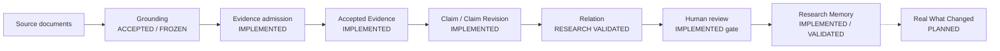
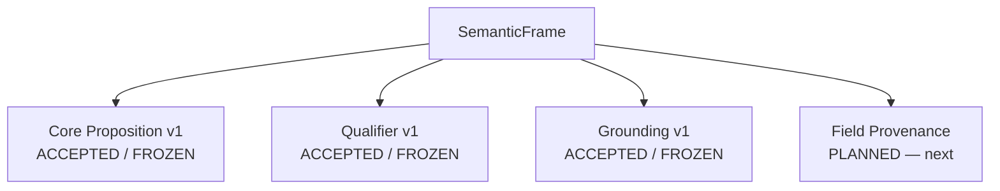

# Architecture

This document describes how FlowCredit is put together and where each layer currently stands. It is research-engineering documentation for a prototype, not production documentation.

Status labels used here: `IMPLEMENTED / VALIDATED`, `ACCEPTED / FROZEN`, `RESEARCH VALIDATED`, `PLANNED`, `LEGACY`. [`status.md`](status.md) is the authoritative list.

## Product data flow

Every step is one-way and append-oriented: evidence is admitted, claims are revised by humans, and history is retained rather than overwritten. The dashed step has no implementation yet and is never presented as finished.

## Semantic frame layers

| Layer | Question | Status |
| --- | --- | --- |
| Core Proposition v1 | What was asserted? | Accepted / Frozen |
| Qualifier v1 | Under what context? | Accepted / Frozen |
| Grounding v1 | Where is the source support? | Accepted / Frozen |
| Field Provenance | How was the structured value produced? | Planned — next |

Grounding v1 keeps source support mechanical: immutable support snapshots, exact text or table cell content, version-pinned replay, and explicit failure when something cannot be resolved. It deliberately does not judge meaning; interpretation and admission are separate layers.

## Evidence admission

Admission is the boundary between "a model proposed something" and "research memory may use it".

- Evidence carries its source, locator and exact supported text or cell.
- An admission review records the decision; admitted records keep that review.
- Model output is a proposal, never an admission. Nothing is silently admitted.
- Grounding validity is necessary but not sufficient: a valid support can still carry the wrong interpretation, and the interpretation layer rejects it.

## Relation architecture

- The frozen relation vocabulary is `SUPPORTS` / `COUNTERS` / `NEUTRAL` / `AMBIGUOUS` ([ADR-0.12.1](../adr/ADR-0.12.1-relation-semantics.md)).
- Relations are pairwise, revision-specific and as-of aware, and they do not mutate claim state.
- `COUNTERS` is a relation label, not a verdict: it does not mean the earlier evidence was false, that risk disappeared, or that a claim should be revised.
- The hybrid relation architecture — a deterministic layer, a verifier layer and a small local model for the residual — is `RESEARCH VALIDATED` on a synthetic development set. A production relation engine is `PLANNED`; the current spike is not a production pipeline.

## Human review boundary

Humans keep research authority:

- A relation or proposal never rewrites a claim; revision proposals remain `pending` until a human review is recorded, and there is no apply operation.
- Reviews are retained with the proposal, including rejections.
- Abstention is an explicit outcome. When the available evidence cannot decide a relation, the system abstains instead of guessing.

## Research memory

Research Memory stores versioned claims and admitted evidence with their lineage: claim identity, revisions, supporting and counter evidence references, and superseded history. It is the historical record the whole system answers to.

Runtime state (Research Memory databases, model sessions, logs) intentionally lives outside this repository. A local surface renders it read-only over loopback for development use.
