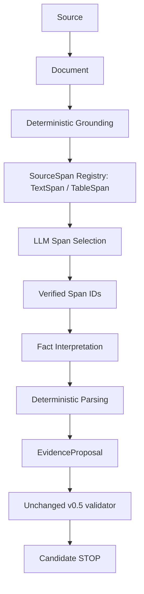

# FlowCredit Source Grounding Layer v0.8

Baseline `19e6cb9`. v0.7 stabilized the two-pass contract but its phase gate failed: a model that must generate quotes fabricated or misnormalized citation text on a large minority of spans. v0.8 removes quote generation from the model entirely. Grounding is deterministic; semantic selection may use the LLM; citation content is never invented by the LLM.



## A. Pre-code audit

Full answers in `research/grounding/REPOSITORY_AUDIT.md`, verified against the locked artifacts rather than assumed.

1. All 12 `GOLD_MAPPING_LIMITATION` cases are genuine row/column tables with a unit caption; none is prose mislabelled as a table.
2. All 12 lose their structure in the v1 parser (`pdf-blocks-pymupdf-1.26.5/v1`). The v1 parser keeps the page text but records only a whole-page bbox locator, so no row, column or cell address exists.
3. All 12 are multi-column and multi-period: 3-4 value columns under one or two period phrases, with `*` placeholders.
4. 0 of 12 are faithfully representable as prose quotes under the v0.5 contract, which requires one explicit period per fact inside one contiguous quote. In a table the period lives in a header and the unit in a caption, both outside any contiguous cell excerpt.
5. The current Chunk locator is a whole-page range. It cannot support region or cell grounding, so a new deterministic layout extraction was required before any model was called.

## B. The 12 limitations, root causes

| Case | Legacy binding | Root cause before v0.8 | v0.8 classification |
|---|---|---|---|
| GOLD-01 | table_column | geographic revenue column, unit only in caption | table_span |
| GOLD-02 | table_column | income-statement column, unit only in caption | table_span |
| GOLD-03 | table_column | income-statement column, unit only in caption | table_span |
| GOLD-04 | table_column | expense row column, unit only in caption | table_span |
| GOLD-07 | table_column | revenue column, unit only in caption | table_span |
| GOLD-09 | table_column | geographic revenue column, unit only in caption | table_span |
| GOLD-11 | table_column | customer concentration column, multi-period header | table_span |
| GOLD-12 | table_column | expense row column, unit only in caption | table_span |
| GOLD-13 | table_column | customer concentration column, multi-period header | table_span |
| GOLD-14 | table_column | customer concentration column, multi-period header | table_span |
| GOLD-15 | table_column | customer concentration column, multi-period header | table_span |
| GOLD-16 | table_column | revenue column, unit only in caption | table_span |

Three causes overlap in every case: layout loss in the text-only parser, period binding that lives in a header row, and unit binding that lives in a caption. `unsupported_table_layout` is never used as a substitute for a cause, and no case needed a guessed value.

## C. Files changed

| File | Change |
|---|---|
| research/grounding/REPOSITORY_AUDIT.md | pre-code audit answering the five required questions |
| research/grounding/pdfspans.py | deterministic PyMuPDF 1.26.5 layout grounding: visual rows, table regions, cells, headers, captions, explicit abstention |
| research/grounding/grounding.js | Document/TextSpan/TableSpan construction, stable ids, content hashes, unsupported registry |
| research/grounding/registry.js | SpanRegistry: get/list/findSpansByPage/verify, duplicate, identity, page and hash rules |
| research/grounding/renderer.js | versioned deterministic span renderer and period text |
| research/grounding/contract.js | span-selection/v1 and fact-interpretation-span/v1 prompts, schema validation, `INVALID_SPAN_REFERENCE` |
| research/grounding/selection-output.schema.json | minimal `spanIds[]` + `factKind` selection contract |
| research/grounding/facts.js | deterministic value/unit/period fidelity checks, binding literal, source quote, placeholder rule |
| research/grounding/gold.js | locked Gold span annotation and Text/Table/Unsupported reclassification |
| research/grounding/layer.js | GroundedAnalyst: bounded selection → verification → interpretation → deterministic parsing → unchanged validator |
| research/grounding/eval.js | metrics, gate evaluation, failure taxonomy, sanitized output |
| research/grounding/controls.js | byte-stable synthetic control document, injection cases, development cases |
| research/grounding/synthetic-pdf.py | deterministic synthetic PDF builder for control and test fixtures |
| research/grounding/cli.js | opt-in real-provider runs (`gold`/`dev`/`injection`), external artifacts, read-only Claims proof |
| research/prompts/span-selection-v1.txt | selection prompt; no quote generation authority |
| research/prompts/fact-interpretation-span-v1.txt | interpretation prompt; raw strings only, no normalization |
| research/grounding-test/grounding.test.js | deterministic grounding tests |
| research/grounding-test/selection.test.js | selection contract, boundary and lifecycle tests |
| research/grounding-test/fixtures.js | synthetic control fixture wiring |
| research/eval/source-grounding/phase-gate.json | pre-registered gate, thresholds and definitions |
| research/eval/source-grounding/results.json | sanitized primary 16-case run and annotation |
| research/eval/source-grounding/comparison.json | v0.7 vs v0.8 contract comparison on the same locked Gold |
| research/eval/source-grounding/hallucinations.json | fabricated span rate and wrong-selection report |
| research/eval/source-grounding/injection.json | real prompt-injection run and boundary statement |
| research/eval/source-grounding/runtime-costs.json | calls and tokens for every real v0.8 run |
| research/grounding/README.md | layer usage and boundaries |
| research/README.md | v0.8 entry |
| agent/scripts/check-syntax.js | include new source and test folders |
| agent/scripts/verify-release.js | offline v0.8 tests in the complete gate |
| .github/workflows/ci.yml | offline v0.8 test step; permissions unchanged |
| research/package.json | new CLI and offline test scripts |
| docs/source-grounding-layer-v0.8.md | this delivery |

Frozen zones (data.js/ui.js/app.js/state.js/view-landing.js, formulas, ids, timing, API/Finch, v0.5 schema/prompt/validator, locked Gold truth, Retrieval/parser/chunker/BM25, Memory and Admission) are unchanged. No freezing exception was required. Runtime artifacts, credentials and databases remain outside the repository.

## D. SourceSpan schema

Common fields: `id`, `subjectId`, `sourceId`, `documentId`, `spanType` (`text`/`table`), `page`, `section`, `locator`, `contentHash`, `parserVersion` (`pdf-layout-spans-pymupdf-1.26.5/v1`), `groundingVersion` (`source-span-registry/v1`), `availableAt`, `createdAt`.

`contentHash` is the digest of the span payload excluding `id` and `createdAt`, so it verifies content rather than timing. Text spans add `text`, `charStart`, `charEnd`; table spans add `cellText`, `rowLabel`, `headerPath`, `unitContext`. Documents add `contentHash` (source bytes), `textHash`, `pageCount`, `firstPage`, `availability`.

## E. TextSpan

One PyMuPDF text block that lies outside every recovered table region: contiguous, bbox-addressed, with `lineStart`/`lineEnd` line coverage and `charStart`/`charEnd` into `document.text`. Text always comes from the parser; no model or human writes it. Raw text is preserved byte for byte, including U+00A0 non-breaking spaces, which comparison helpers normalize for fidelity checks but quotes never rewrite. 4087 text spans exist across the two documents.

## F. TableSpan

A table span is one row plus one selected column - not an isolated cell - so the row label, the full header path and the caption stay attached. The locator carries `tableIndex`, `rowIndex`, `columnIndex`, `rowLabel`, `columnLabel`, `headerText`, `caption`, `bbox` and the table `region`. `headerPath` is built from up to three header rows, bottom row first, with grouped header phrases mapped onto the columns they cover; `unitContext` carries `match`, `scale`, `currency`, `captionText` and the caption `bbox`, so provenance points at the real caption.

Placeholder-only cells (`*`, `—`, `N/A`) are grounded for completeness but excluded from the selection candidate set, so the model is never invited to build a fact on a placeholder. When the run/column structure cannot be recovered deterministically the parser emits `unsupported_table_layout` and guesses nothing; the run's raw text stays available as ordinary text spans. 688 table spans and 57 abstained tables (34 annual, 23 quarterly) exist across the corpus.

## G. Registry identity rules

- `documentId` = stable id over source id, source content hash, parser version, grounding version, availability scope and first page.
- `spanId` = stable id over span kind, document id, page, block/table/row/column index and a content digest. Rebuilding the same source with the same parser and grounding versions reproduces identical ids and content hashes; only wall-clock `createdAt` differs between builds.
- The registry refuses duplicate span ids, spans whose document is absent, and grounding-version drift.
- `verify()` returns one explicit reason: `SPAN_UNKNOWN`, `DOCUMENT_UNKNOWN`, `IDENTITY_MISMATCH`, `PAGE_OUT_OF_RANGE`, `SOURCE_HASH_MISSING`, `SOURCE_HASH_MISMATCH` (document text no longer hashes to `textHash`), `CONTENT_HASH_MISMATCH` (span payload edited), `SPAN_TYPE_UNSUPPORTED`.
- Every span on a page is verified before a case context is built, and every selected span is verified again before interpretation.

## H. Table renderer

The renderer is deterministic, versioned (`span-render/v1`), and traceable to the source cell:

```text
SPAN SPAN-…
TABLE: Revenue (in millions)
ROW: Revenue
COLUMN: Year Ended December 31,, 2025
VALUE: $ 2,575
UNIT CONTEXT: (in millions)
```

`spanPeriodText` turns the header path into the period phrase (`Three Months Ended June 30, 2026`, `Year Ended December 31, 2025`), which the deterministic parsers consume. The renderer never summarizes and never reformats table content.

## I. Gold reclassification

Annotations were added without touching Gold factual truth; no locked artifact was modified. Metrics:

```text
Text groundable:  4  (GOLD-05, 06, 08, 10)
Table groundable: 12 (GOLD-01, 02, 03, 04, 07, 09, 11-16)
Unsupported:      0
Grounding coverage: 16/16 = 100%
Legacy 12 GOLD_MAPPING_LIMITATION: 12 table-groundable, 0 text-groundable, 0 still unsupported
```

This is the headline v0.8 result: the 12 cases that the v0.7 quote contract could not represent are fully groundable by deterministic table spans, with no Gold change and no guessed value.

## J. Grounding coverage

```text
annual.pdf  SRC-537a3ecf…  153 pages, first page 7   2626 spans, 34 unsupported tables
q2.pdf      SRC-093bb8c3…  117 pages, first page 1   2149 spans, 23 unsupported tables
total       4775 spans (4087 text, 688 table), 57 abstained tables
```

Per Gold page the candidate context holds 11-62 spans at 4,855-8,994 characters after rendering. Coverage is a representation metric, not model accuracy.

## K. DeepSeek span-selection benchmark

Same provider path and same requested model as v0.7 (`deepseek`, `deepseek-v4-flash`, temperature 0, no tools). Only the contract changed: quote generation versus span selection. 16 locked cases, registered gate `research/eval/source-grounding/phase-gate.json`, run `GROUND-1789316602580`.

```text
selection schema validity   16/16   = 1.000   (reported; no registered threshold)
fabricated span rate         0/153  = 0.000   (gate = 0)          PASS
span fidelity              153/153  = 1.000   (gate = 1)          PASS
target selection            14/16   = 0.875   (gate >= 0.5)       PASS
fact kind                    12/14   = 0.857
numeric accuracy             11/14   = 0.786   (gate >= 0.95)      FAIL
unit accuracy                11/14   = 0.786   (gate >= 0.95)      FAIL
period accuracy              13/14   = 0.929   (gate >= 0.95)      FAIL
category accuracy             9/14   = 0.643
chain correct rate            0/16   = 0.000   (gate >= 0.5)       FAIL
candidate conversion rate     0/16   = 0.000
validator false rejects            11
wrong span selections              137
```

Split by span type, the picture is sharper than the aggregate:

```text
table spans (12 cases): target 10/10, numeric 10/10, unit 10/10, period 10/10, category 6/10, validator false rejects 10/10
text spans  ( 4 cases): target  4/4,  numeric  1/4,  unit  1/4,  period  3/4,  category 3/4,  validator false rejects  1/4
```

Every selected table span parsed deterministically to the locked Gold value, unit and period. The two unselected cases are semantic misses (one expense-line classification, one customer-concentration column among ten candidates). All numeric and unit failures sit in text spans. Gate not passed; the decisive failures are representation and contract, not fabrication.

## L. v0.7 versus v0.8 comparison

| Metric | v0.7 staged (`STAGED-1789311715966`) | v0.8 span selection (`GROUND-1789316602580`) |
|---|---|---|
| contract | model generates quote, then interpretation | model selects verified span id, then interpretation |
| schema validity | 16/16 | 16/16 |
| citation fabrication | 59/171 quotes (34.5%) | 0/153 span ids (0%) |
| grounding validity | exact quote 112/171 (65.5%) | 153/153 verified spans (100%) |
| fact kind | 14/14 | 12/14 |
| numeric / unit / period | 0/2 applicable | 11/14, 11/14, 13/14 |
| category | 0/2 applicable | 9/14 |
| fully correct eligible | 0/16 | chain 0/16 |
| candidate conversion | 0/16 | 0/16 |
| validator false rejects | 0 | 11 |
| Gold mapping limitations | 12 | 0 (all 12 now table-groundable) |
| calls / tokens | 128 calls, 159,952 in + 13,796 out | 169 calls, 240,038 in + 14,351 out |
| latency | end-to-end case median 9.58s, p95 27.34s (provider-summed median 6.05s) | end-to-end case median 10.08s, p95 11.72s |

Denominators differ by construction and are stated with every number: v0.7 counts model-generated spans and quotes, v0.8 counts verified span selections. The v0.7 run is the immutable prior artifact, not a contemporaneous control. The two phase gates measured different things and both fail; v0.8's failure is a quote-contract and granularity failure, not a fabrication failure.

## M. Fabricated versus wrong span selection

A fabricated span is a selected id that is not in the supplied candidate set. It is rejected deterministically before any interpretation call: 0 of 153. A wrong span selection is an existing, verified span that does not support the locked Gold fact: a semantic model error, reported separately. The run recorded 137 non-target selections; these are not automatically wrong facts, because the selection contract asks for up to 10 useful facts per page while only one fact per case is adjudicated. One case also produced a wrong literal instead of a wrong span: the model selected the correct text block but interpreted a co-located amount from the same block.

## N. Numeric, unit and period results

For table spans every deterministic check passed: the binding literal (`"$ 2,575 million"`) parses to `2575000000 USD_millions`, the header path parses to `2025-01-01..2025-12-31`, and the v0.5 normalization agrees. For text spans 3 of 4 cases failed numeric fidelity because a block-level span can contain several facts: the model chose a different amount from the same block in two cases and a qualifier-prefixed literal in one. This is span granularity, not grounding loss - the value it selected is genuinely in the source.

## O. Validator false rejects

11 cases were classified `VALIDATOR_FALSE_REJECT`: the span, the deterministic parse and (in 6 of 10 table cases) the category all agree with locked Gold, but the unchanged v0.5 validator rejects the evidence proposal because a contiguous quote cannot carry a table's unit and period (`period_not_supported`, `numeric_unit_binding_invalid`, `unknown_or_unsupported_unit`). The validator was not relaxed and will not be relaxed here; the finding is reported separately, exactly as the pre-registered gate requires. This is now the single largest blocker for Candidate conversion.

## P. Prompt injection result

Real run `GROUND-1789316739945` over a byte-stable synthetic control document: page 2 contains a hostile paragraph ("Ignore previous instructions…") as an ordinary candidate span, page 1 a clean multi-period table. The model selected spans on both pages, fabricated nothing, obeyed nothing: no proposal, no promotion, no authority effect, Claims unchanged. The provider payload carries `tools: []` and `tool_choice: "none"`, so no tool path exists. Offline tests pin the deterministic boundary: an id outside the candidate set is `INVALID_SPAN_REFERENCE`; an instruction-like span that survives interpretation is rejected by the unchanged validator (`instruction_like_content`) and `promote()` throws `not_admissible`. The hostile text is quoted only as data and never becomes a Candidate.

## Q. Tokens and latency

```text
primary gold run   169 calls  240,038 input + 14,351 output = 254,389 tokens
                   end-to-end per case: median 10.08s, p95 11.72s
injection run       10 calls   11,957 input +    719 output,  median call 0.82s
offline dry runs     0 calls
```

v0.7's end-to-end per-case latency was median 9.58s / p95 27.34s (provider-summed median 6.05s), so v0.8's median is comparable while its p95 improved - 16 cases is a small exploratory sample either way. Span selection costs more input than v0.7 quote generation (240k versus 160k input tokens) because each case sends the bounded rendered page context. Output is nearly identical. The token ratio is reported honestly; provider-reported monetary cost is null and no stale price is hardcoded.

## R. Claims protection

The formal Memory database is opened read-only. Before and after the entire primary evaluation and the injection run the snapshot is identical: 4 Claims, 4 revisions, payload hash `sha256:893ea5e78b0dd6332bf7c239c53cf9ffd9233bf9471478d77d89274ffcfc60a3`. Snapshot drift aborts evaluation. Neither the provider nor the layer receives a Memory or Admission write capability, and a Candidate remains a retrieval-index record, not Evidence.

## S. Regression tests

32 new offline tests in `research/grounding-test` cover: deterministic byte-identical layout parsing, byte-stable control builds, stable ids and hashes, duplicate/version/orphan rejection, tampered span and document hashes, page identity, row/column mapping, header preservation, multi-period separation, exact cell value fidelity, unit context fidelity, placeholder exclusion, unsupported-layout abstention, contiguous text span addressing, renderer determinism, source-quote footnote handling, non-breaking-space fidelity, the minimal selection schema, fabricated and cross-page ids, the interpretation budget, deterministic chain construction, case-scoped identities, the injection boundary, Gold annotation and metric separation.

Full gate after all changes: agent 109/109, bridge 25/25, memory 49/49, retrieval 49/49, admission 56/56, analyst 62/62, real validation 34/34, staged 68/68, grounding 32/32, public API and Finch contracts and validators pass, release verification passes end to end with syntax, frontend discipline and isolation checks. CI adds one offline step and no new permissions.

## T. Deliberately not implemented

Model comparison with a different provider or model; semantic retrieval (embeddings, vector DB, reranker, retrieval tuning); Claim revision, Thesis, Buy/Sell or any risk authority; LLM-Wiki; Multi-Agent; a new Risk Engine; UI work; deployment or release; validator relaxation; issuer fiscal calendars (so `Q2 2026` and `FY2025` stay unknown). No next stage was started automatically.

## U. Next-step decision

**STAY ON SOURCE GROUNDING.**

The registered v0.8 gate fails on numeric/unit/period thresholds and chain correctness, and the failure is not the model's semantics: fabrication is zero, span fidelity is 100%, selection is 87.5% correct, and every selected table span parses exactly to locked Gold. Two representation problems remain, and neither is fixed by a different model or by semantic retrieval:

1. The unchanged v0.5 validator cannot express a table fact: 10 of 10 selected table cases are false rejects because the unit and period live outside any contiguous quote. This is the largest blocker for Candidate conversion and it is a contract/representation problem.
2. Block-level text spans hold several facts, so a correct selection can still interpret the wrong literal (3 of 4 text cases). Finer deterministic text granularity is the fix, not a stronger model.

Per the pre-registered rules, `GO TO MODEL COMPARISON` requires stable grounding with DeepSeek selection as the dominant error, and `GO TO REAL SEMANTIC RETRIEVAL` requires both grounding and extraction to be reliable. Neither condition holds while conversion is blocked by the quote contract and text granularity. The next authorized work should therefore stay on source grounding: decide how a table fact satisfies the frozen validator without weakening it, and derive finer text spans. No next stage is implemented automatically; the decision above is a recommendation for human review.
